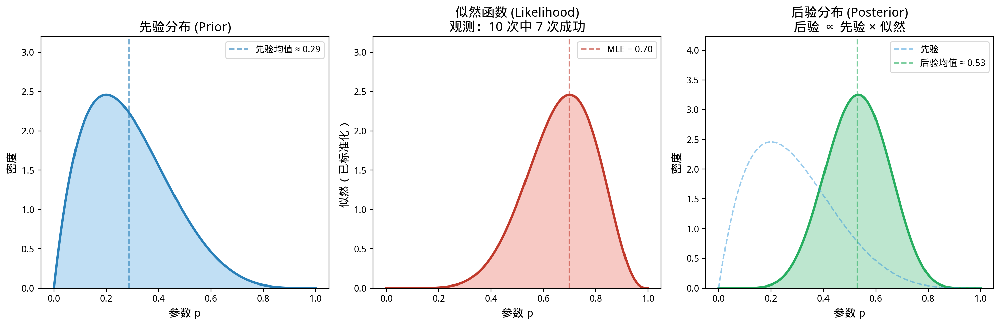
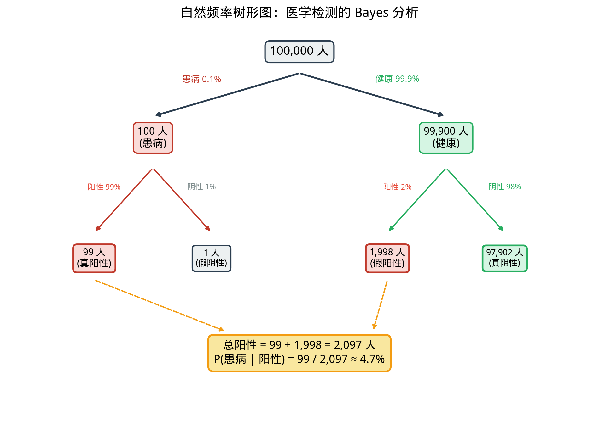

# §2 Bayes 定理（Bayes' Theorem）

**前置知识**：[§1 条件概率与乘法规则](01-conditional-probability.md)（条件概率、乘法规则、全概率公式）

**全景图**：Bayes 定理是概率论中最具影响力的定理之一。它将"已知原因求结果的概率"翻转为"已知结果推断原因的概率"。本节从全概率公式出发推导 Bayes 定理，然后通过医学检测和垃圾邮件过滤两个经典应用展示其威力。我们还将介绍自然频率方法——一种直觉友好的理解 Bayes 推理的途径。

**预估学习时间**：约 3–4 小时

---

## 动机

在上一节的自测题中，我们遇到了一个令人吃惊的结果：即使检测很准确（灵敏度 $99\%$，特异度 $95\%$），当疾病罕见时（发病率 $1\%$），检测阳性者实际患病的概率仅有约 $16.7\%$。

这个结果违反直觉，但数学不会骗人。Bayes 定理给出了精确的计算方法，并揭示了一个深刻的道理：**后验概率不仅取决于检测的准确性，还取决于先验概率（基础率）**。

---

## 1. Bayes 定理的推导

### 1.1 从条件概率出发

由条件概率定义：

$$P(B_i \mid A) = \frac{P(A \cap B_i)}{P(A)} = \frac{P(A \mid B_i) \cdot P(B_i)}{P(A)}$$

将全概率公式代入分母：

### 1.2 Bayes 定理

> **定理 1**（Bayes 定理 / Bayes' theorem）
>
> 设 $B_1, B_2, \ldots, B_n$ 是 $\Omega$ 的一个划分，$P(B_i) > 0$，且 $P(A) > 0$。则
>
> $$P(B_i \mid A) = \frac{P(A \mid B_i) \cdot P(B_i)}{\displaystyle\sum_{j=1}^{n} P(A \mid B_j) \cdot P(B_j)}$$

### 1.3 术语

| 术语 | 符号 | 含义 |
|------|------|------|
| 先验概率（prior） | $P(B_i)$ | 在观测到 $A$ 之前，对 $B_i$ 的初始判断 |
| 似然（likelihood） | $P(A \mid B_i)$ | 在 $B_i$ 成立时，$A$ 发生的概率 |
| 后验概率（posterior） | $P(B_i \mid A)$ | 观测到 $A$ 之后，对 $B_i$ 的更新判断 |
| 边际似然（evidence） | $P(A)$ | 在所有可能的 $B_i$ 下，$A$ 的总概率 |

Bayes 定理的核心逻辑是：

$$\text{后验} = \frac{\text{似然} \times \text{先验}}{\text{证据}}$$

或更简洁地：

$$\text{后验} \propto \text{似然} \times \text{先验}$$

---

## 2. 两分类情形

当划分为 $\{B, B^c\}$ 时，Bayes 定理简化为：

$$P(B \mid A) = \frac{P(A \mid B) \cdot P(B)}{P(A \mid B) \cdot P(B) + P(A \mid B^c) \cdot P(B^c)}$$

---

## 3. 经典应用一：医学检测

> **例 1**（医学检测）
>
> 某种罕见疾病的发病率为 $0.1\%$（千分之一）。一种检测方法的性能为：
> - **灵敏度**（sensitivity）：$P(+ \mid D) = 0.99$（患者检测阳性的概率）
> - **特异度**（specificity）：$P(- \mid D^c) = 0.98$（健康者检测阴性的概率）
>
> 一个随机选取的人检测阳性。他实际患病的概率是多少？

**解**：$P(D) = 0.001$，$P(D^c) = 0.999$，$P(+ \mid D) = 0.99$，$P(+ \mid D^c) = 1 - 0.98 = 0.02$。

由 Bayes 定理：

$$P(D \mid +) = \frac{P(+ \mid D) \cdot P(D)}{P(+ \mid D) \cdot P(D) + P(+ \mid D^c) \cdot P(D^c)}$$

$$= \frac{0.99 \times 0.001}{0.99 \times 0.001 + 0.02 \times 0.999} = \frac{0.00099}{0.00099 + 0.01998} = \frac{0.00099}{0.02097} \approx 0.0472$$

**结论**：检测阳性者实际患病的概率只有约 $4.7\%$！

### 为什么这么低？

关键在于**基础率**（base rate）。疾病很罕见（$0.1\%$），即使检测很准确，大量健康人中的少数"假阳性"也远远多于少数患者中的"真阳性"。

| 类别 | 人数（每 $100{,}000$ 人） | 阳性人数 |
|------|--------------------------|---------|
| 患者 | $100$ | $100 \times 0.99 = 99$（真阳性） |
| 健康者 | $99{,}900$ | $99{,}900 \times 0.02 = 1{,}998$（假阳性） |
| **总阳性** | | $99 + 1{,}998 = 2{,}097$ |

$$P(D \mid +) = \frac{99}{2{,}097} \approx 4.7\% \quad \blacksquare$$

### 连续检测

如果第一次阳性后再做一次独立检测，且也是阳性呢？

此时先验更新为 $P(D) = 0.047$。重新应用 Bayes 定理：

$$P(D \mid ++) = \frac{0.99 \times 0.047}{0.99 \times 0.047 + 0.02 \times 0.953} = \frac{0.04653}{0.04653 + 0.01906} = \frac{0.04653}{0.06559} \approx 0.709$$

两次阳性后，患病概率上升到约 $71\%$——Bayes 更新的力量！

---

## 4. 自然频率方法（Natural Frequency Approach）

很多人发现直接用 Bayes 公式不直观。一种替代方法是用**自然频率**（natural frequencies）——将问题转化为具体人数。

### 方法

假设有 $N$ 个人（取一个方便的数，如 $N = 100{,}000$）：

1. 患者 $N \cdot P(D)$ 人，其中阳性 $N \cdot P(D) \cdot P(+ \mid D)$ 人
2. 健康者 $N \cdot P(D^c)$ 人，其中阳性 $N \cdot P(D^c) \cdot P(+ \mid D^c)$ 人
3. 总阳性 = 真阳性 + 假阳性
4. 所求概率 = 真阳性 / 总阳性

自然频率方法与 Bayes 公式在数学上完全等价，但对很多人来说更直观——因为人脑更擅长处理"频率"而非"概率"。

---

## 5. 经典应用二：垃圾邮件过滤

> **例 2**（朴素 Bayes 垃圾邮件过滤）
>
> 一个邮箱收到的邮件中，$40\%$ 是垃圾邮件（spam），$60\%$ 是正常邮件。某个特定词语（如"免费"）在垃圾邮件中出现的概率是 $80\%$，在正常邮件中出现的概率是 $10\%$。一封邮件包含"免费"这个词，求它是垃圾邮件的概率。

**解**：$S$ = 垃圾邮件，$W$ = 包含"免费"。

$P(S) = 0.4$，$P(S^c) = 0.6$，$P(W \mid S) = 0.8$，$P(W \mid S^c) = 0.1$。

$$P(S \mid W) = \frac{P(W \mid S) \cdot P(S)}{P(W \mid S) \cdot P(S) + P(W \mid S^c) \cdot P(S^c)} = \frac{0.8 \times 0.4}{0.8 \times 0.4 + 0.1 \times 0.6} = \frac{0.32}{0.32 + 0.06} = \frac{0.32}{0.38} \approx 0.842$$

包含"免费"一词的邮件约有 $84.2\%$ 的概率是垃圾邮件。

实际的垃圾邮件过滤器（如 SpamBayes）会对多个词语同时应用 Bayes 定理，综合判断。$\blacksquare$

---

## 6. 先验 → 后验：Bayes 更新

Bayes 定理最深刻的思想是**迭代更新**：

1. **先验**（prior）：观测数据之前的初始信念 $P(B_i)$
2. **数据**（data）：观测到事件 $A$
3. **后验**（posterior）：更新后的信念 $P(B_i \mid A)$

后验概率可以作为新的先验，当更多数据到来时继续更新。这就是**Bayes 推断**（Bayesian inference）的核心思想。

> **例 3**（硬币偏差判断）
>
> 有两枚硬币：硬币 $A$ 是公平的（$P(H) = 0.5$），硬币 $B$ 是偏的（$P(H) = 0.8$）。随机拿一枚（各 $50\%$ 概率），掷了 $3$ 次得到 $3$ 次正面。这枚硬币是偏的那枚的概率是多少？

**解**：$P(B) = 0.5$（先验），$P(A) = 0.5$。

观测 $D$ = "$3$ 次正面"。

$P(D \mid A) = 0.5^3 = 0.125$。

$P(D \mid B) = 0.8^3 = 0.512$。

$$P(B \mid D) = \frac{P(D \mid B) \cdot P(B)}{P(D \mid A) \cdot P(A) + P(D \mid B) \cdot P(B)} = \frac{0.512 \times 0.5}{0.125 \times 0.5 + 0.512 \times 0.5} = \frac{0.256}{0.0625 + 0.256} = \frac{0.256}{0.3185} \approx 0.804$$

$3$ 次正面后，偏硬币的后验概率从 $50\%$ 上升到约 $80\%$。$\blacksquare$

---

## 7. Bayes 定理的比值形式（Odds Form）

定义事件的**赔率**（odds）为 $O(B) = P(B) / P(B^c)$。Bayes 定理可以写成赔率形式：

$$\frac{P(B \mid A)}{P(B^c \mid A)} = \frac{P(A \mid B)}{P(A \mid B^c)} \cdot \frac{P(B)}{P(B^c)}$$

即：

$$\text{后验赔率} = \text{似然比（likelihood ratio）} \times \text{先验赔率}$$

似然比 $\Lambda = P(A \mid B) / P(A \mid B^c)$ 衡量了数据 $A$ 对假设 $B$ 的"支持力度"。

---

## 例题

> **例题 1**
>
> 三个盒子。盒 1 有 $2$ 红 $3$ 蓝，盒 2 有 $4$ 红 $1$ 蓝，盒 3 有 $3$ 红 $2$ 蓝。等概率选一个盒子，随机取一球是红色的。求这球来自盒 2 的概率。

**解**：$P(B_i) = 1/3$（$i = 1,2,3$）。

$P(R \mid B_1) = 2/5$，$P(R \mid B_2) = 4/5$，$P(R \mid B_3) = 3/5$。

$P(R) = (2/5)(1/3) + (4/5)(1/3) + (3/5)(1/3) = (2+4+3)/(5 \times 3) = 9/15 = 3/5$。

$$P(B_2 \mid R) = \frac{P(R \mid B_2)P(B_2)}{P(R)} = \frac{(4/5)(1/3)}{3/5} = \frac{4/15}{9/15} = \frac{4}{9} \approx 0.444 \quad \blacksquare$$

> **例题 2**
>
> $1\%$ 的乘客携带违禁品。安检设备检测到违禁品的概率为 $95\%$，误报率为 $3\%$。安检报警时，乘客实际携带违禁品的概率是多少？

**解**：$P(V) = 0.01$，$P(+ \mid V) = 0.95$，$P(+ \mid V^c) = 0.03$。

$$P(V \mid +) = \frac{0.95 \times 0.01}{0.95 \times 0.01 + 0.03 \times 0.99} = \frac{0.0095}{0.0095 + 0.0297} = \frac{0.0095}{0.0392} \approx 0.242$$

约 $24.2\%$。$\blacksquare$

---

## 要点回顾

| 概念 | 要点 |
|------|------|
| Bayes 定理 | 后验 $\propto$ 似然 $\times$ 先验 |
| 先验概率 | 观测数据前的初始信念 |
| 后验概率 | 观测数据后的更新信念 |
| 基础率谬误 | 忽略先验概率（基础率）导致错误判断 |
| 自然频率 | 将概率问题转化为具体人数，更直观 |
| Bayes 更新 | 后验可作为新先验，迭代更新 |

---

## 进度检查点

完成本节后，你应该能够：

- [ ] 从全概率公式推导 Bayes 定理
- [ ] 在医学检测问题中应用 Bayes 定理
- [ ] 使用自然频率方法直观理解 Bayes 推理
- [ ] 解释为什么罕见疾病的阳性检测不一定意味着患病
- [ ] 理解先验→后验的更新过程

---

## 自测题

**题 1**：$P(B) = 0.3$，$P(A \mid B) = 0.8$，$P(A \mid B^c) = 0.2$。求 $P(B \mid A)$。

答案

$P(A) = 0.8 \times 0.3 + 0.2 \times 0.7 = 0.24 + 0.14 = 0.38$。

$P(B \mid A) = 0.24/0.38 = 12/19 \approx 0.632$。

**题 2**：疾病发病率 $5\%$，灵敏度 $90\%$，特异度 $90\%$。阳性检测下的患病概率？

答案

$P(D \mid +) = \frac{0.90 \times 0.05}{0.90 \times 0.05 + 0.10 \times 0.95} = \frac{0.045}{0.045 + 0.095} = \frac{0.045}{0.140} \approx 0.321$。

即使发病率从 $0.1\%$ 提高到 $5\%$，阳性后患病的概率也只有约 $32\%$。

**题 3**：在例 3（硬币判断）中，如果第 $4$ 次掷出反面，更新后偏硬币的概率是多少？

答案

新先验 $P(B) = 0.804$，$P(A) = 0.196$。

$P(T \mid A) = 0.5$，$P(T \mid B) = 0.2$。

$P(B \mid T) = \frac{0.2 \times 0.804}{0.5 \times 0.196 + 0.2 \times 0.804} = \frac{0.1608}{0.098 + 0.1608} = \frac{0.1608}{0.2588} \approx 0.621$。

一次反面使偏硬币的概率从 $80.4\%$ 降到 $62.1\%$。

---

## 习题引用

本节的练习见 [exercises/exercises.md](exercises/exercises.md)。
