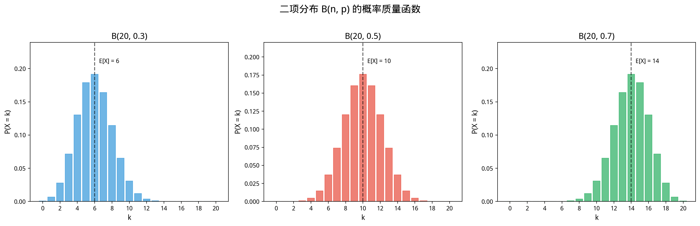
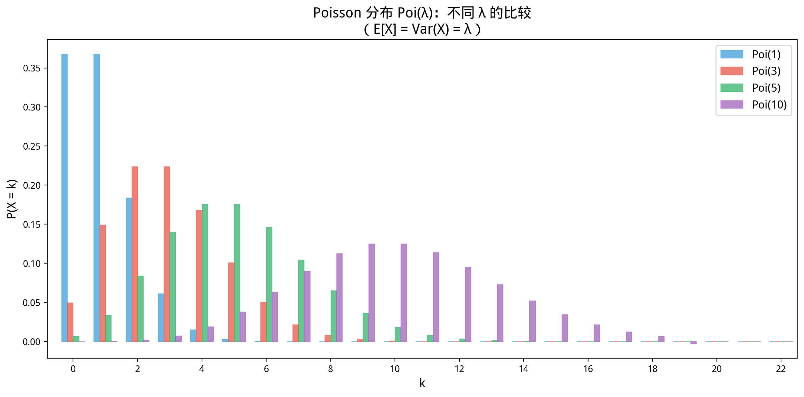

# §2 常见离散分布（Common Discrete Distributions）

**前置知识**：[§1 离散随机变量](01-discrete-rv.md)（随机变量、PMF、CDF）、[Part 7 第 2 章 排列组合](../../part-07-combinatorics/ch02-permutations-combinations/README.md)（组合数）、[Part 7 第 3 章 二项式定理](../../part-07-combinatorics/ch03-binomial/README.md)（二项式展开）、[Part 6 第 4 章 级数](../../part-06-analysis-prep/ch04-series/README.md)（$e^x$ 的级数展开）

**全景图**：本节系统学习五种最重要的离散分布。每种分布都有特定的"故事"——什么样的实验产生什么样的分布。掌握这些分布及其性质（PMF、均值、方差），是概率论应用的基础。特别重要的是 Poisson 分布——它作为二项分布在"$n$ 大、$p$ 小"时的极限，在许多实际问题中自然出现。

**预估学习时间**：约 4–5 小时

---

## 动机

概率论的威力在于：很多看似不同的随机现象，其实服从**相同的数学模型**。一旦识别出问题背后的分布，所有的概率计算就有了现成的公式。

本节学习的五种分布覆盖了离散概率中最常见的场景：

| 分布 | 典型场景 |
|------|----------|
| Bernoulli | 单次是/否试验 |
| 二项分布 | $n$ 次独立重复试验中的成功次数 |
| 几何分布 | 首次成功前的等待时间 |
| Poisson 分布 | 单位时间/空间内的稀有事件次数 |
| 超几何分布 | 不放回抽样中的某类个数 |

---

## 1. Bernoulli 分布（Bernoulli Distribution）

### 1.1 故事

最简单的随机实验：只有两个结果——"成功"（$1$）或"失败"（$0$）。

### 1.2 定义

> **定义 1**（Bernoulli 分布）
>
> 若随机变量 $X$ 只取值 $0$ 或 $1$，且 $P(X = 1) = p$，$P(X = 0) = 1 - p = q$，则 $X$ 服从参数为 $p$ 的 **Bernoulli 分布**，记作
>
> $$X \sim \text{Bernoulli}(p)$$

PMF 可以写为一个公式：$p_X(x) = p^x (1-p)^{1-x}$，$x \in \{0, 1\}$。

### 1.3 均值和方差

$$E[X] = 0 \cdot q + 1 \cdot p = p$$

$$E[X^2] = 0^2 \cdot q + 1^2 \cdot p = p$$

$$\text{Var}(X) = E[X^2] - (E[X])^2 = p - p^2 = p(1-p) = pq$$

| 参数 | $E[X]$ | $\text{Var}(X)$ |
|------|--------|-----------------|
| $p$ | $p$ | $p(1-p)$ |

当 $p = 1/2$ 时方差最大（$= 1/4$），当 $p \to 0$ 或 $p \to 1$ 时方差趋于 $0$（几乎确定）。

---

## 2. 二项分布（Binomial Distribution）

### 2.1 故事

进行 $n$ 次**独立**的 Bernoulli 试验，每次成功概率 $p$。$X$ = 成功的总次数。

### 2.2 定义

> **定义 2**（二项分布）
>
> $$X \sim B(n, p) \quad \text{（或 $\text{Binomial}(n, p)$）}$$
>
> PMF 为：
>
> $$P(X = k) = \binom{n}{k} p^k (1-p)^{n-k}, \quad k = 0, 1, \ldots, n$$

### 2.3 PMF 的推导

在 $n$ 次试验中，恰好 $k$ 次成功：
- 选择哪 $k$ 次成功：$\binom{n}{k}$ 种选法
- 这 $k$ 次成功的概率：$p^k$
- 其余 $n-k$ 次失败的概率：$(1-p)^{n-k}$
- 由独立性，每种具体序列的概率 $= p^k(1-p)^{n-k}$

所以 $P(X = k) = \binom{n}{k} p^k (1-p)^{n-k}$。

### 2.4 验证归一化

$$\sum_{k=0}^{n} \binom{n}{k} p^k (1-p)^{n-k} = (p + (1-p))^n = 1^n = 1 \quad \checkmark$$

这正是二项式定理！

### 2.5 均值

$$E[X] = \sum_{k=0}^{n} k \binom{n}{k} p^k q^{n-k}$$

利用 $k\binom{n}{k} = n\binom{n-1}{k-1}$：

$$= np \sum_{k=1}^{n} \binom{n-1}{k-1} p^{k-1} q^{n-k} = np \sum_{j=0}^{n-1} \binom{n-1}{j} p^j q^{n-1-j} = np \cdot 1 = np$$

**直觉**：$n$ 次试验，每次期望贡献 $p$，总期望 $np$。

### 2.6 方差

$$\text{Var}(X) = np(1-p) = npq$$

**推导思路**：$X = X_1 + X_2 + \cdots + X_n$，其中 $X_i \sim \text{Bernoulli}(p)$ 独立。由独立随机变量方差的可加性（Ch04 §2）：

$$\text{Var}(X) = \sum_{i=1}^{n} \text{Var}(X_i) = n \cdot pq$$

### 2.7 图形

> **例 1**（质量控制）
>
> 一批产品中次品率 $5\%$。随机抽取 $20$ 件检查，求恰好发现 $2$ 件次品的概率。

**解**：$X \sim B(20, 0.05)$。

$$P(X = 2) = \binom{20}{2} (0.05)^2 (0.95)^{18} = 190 \times 0.0025 \times 0.3972 \approx 0.189 \quad \blacksquare$$

---

## 3. 几何分布（Geometric Distribution）

### 3.1 故事

重复进行独立 Bernoulli 试验（成功概率 $p$），直到**第一次成功**。$X$ = 尝试的总次数。

### 3.2 定义

> **定义 3**（几何分布）
>
> $$X \sim \text{Geom}(p)$$
>
> PMF 为：
>
> $$P(X = k) = (1-p)^{k-1} p, \quad k = 1, 2, 3, \ldots$$

含义：前 $k-1$ 次失败（概率 $(1-p)^{k-1}$），第 $k$ 次成功（概率 $p$）。

### 3.3 验证归一化

$$\sum_{k=1}^{\infty} (1-p)^{k-1} p = p \sum_{j=0}^{\infty} (1-p)^j = p \cdot \frac{1}{1-(1-p)} = p \cdot \frac{1}{p} = 1 \quad \checkmark$$

### 3.4 均值和方差

$$E[X] = \frac{1}{p}, \quad \text{Var}(X) = \frac{1-p}{p^2}$$

**均值的推导**：

$$E[X] = \sum_{k=1}^{\infty} k(1-p)^{k-1}p = p \sum_{k=1}^{\infty} k q^{k-1} = p \cdot \frac{1}{(1-q)^2} = p \cdot \frac{1}{p^2} = \frac{1}{p}$$

（利用 $\sum_{k=1}^{\infty} k x^{k-1} = 1/(1-x)^2$，$|x| < 1$。）

**直觉**：成功概率 $p = 1/6$（掷骰子出 $6$），平均需要 $1/p = 6$ 次。

### 3.5 无记忆性

> **命题 1**（无记忆性 / memoryless property）
>
> 若 $X \sim \text{Geom}(p)$，则对任意 $m, n \geq 1$，
>
> $$P(X > m + n \mid X > m) = P(X > n)$$

即"已经失败了 $m$ 次"不会增加未来成功的概率——每次试验都是"全新的开始"。

**证明**：$P(X > k) = (1-p)^k$（前 $k$ 次全部失败）。

$$P(X > m+n \mid X > m) = \frac{P(X > m+n)}{P(X > m)} = \frac{(1-p)^{m+n}}{(1-p)^m} = (1-p)^n = P(X > n) \quad \blacksquare$$

几何分布是**唯一**具有无记忆性的离散分布。

> **例 2**（等待问题）
>
> 某电话客服接通率 $30\%$（每次独立）。平均需要打多少次才能接通？接通前打超过 $5$ 次的概率？

**解**：$X \sim \text{Geom}(0.3)$。

$E[X] = 1/0.3 \approx 3.33$ 次。

$P(X > 5) = (1 - 0.3)^5 = 0.7^5 \approx 0.168$。$\blacksquare$

---

## 4. Poisson 分布（Poisson Distribution）

### 4.1 故事

在固定的时间/空间区间内，"稀有事件"发生的次数。例如：

- 一小时内收到的电子邮件数
- 一页纸上的印刷错误数
- 一天内某十字路口的交通事故数

### 4.2 定义

> **定义 4**（Poisson 分布）
>
> $$X \sim \text{Poi}(\lambda)$$
>
> PMF 为：
>
> $$P(X = k) = \frac{\lambda^k e^{-\lambda}}{k!}, \quad k = 0, 1, 2, \ldots$$
>
> 其中 $\lambda > 0$ 是**速率参数**（rate parameter），表示单位区间内事件的平均次数。

### 4.3 验证归一化

$$\sum_{k=0}^{\infty} \frac{\lambda^k e^{-\lambda}}{k!} = e^{-\lambda} \sum_{k=0}^{\infty} \frac{\lambda^k}{k!} = e^{-\lambda} \cdot e^{\lambda} = 1 \quad \checkmark$$

利用了 $e^x$ 的 Taylor 展开 $\sum_{k=0}^{\infty} x^k/k! = e^x$。

### 4.4 均值和方差

$$E[X] = \lambda, \quad \text{Var}(X) = \lambda$$

Poisson 分布的特殊性质：**均值等于方差**。

**均值推导**：

$$E[X] = \sum_{k=0}^{\infty} k \cdot \frac{\lambda^k e^{-\lambda}}{k!} = \sum_{k=1}^{\infty} \frac{\lambda^k e^{-\lambda}}{(k-1)!} = \lambda e^{-\lambda} \sum_{j=0}^{\infty} \frac{\lambda^j}{j!} = \lambda e^{-\lambda} \cdot e^{\lambda} = \lambda$$

**方差推导**：类似计算 $E[X(X-1)]$：

$$E[X(X-1)] = \sum_{k=2}^{\infty} k(k-1) \frac{\lambda^k e^{-\lambda}}{k!} = \lambda^2 e^{-\lambda} \sum_{j=0}^{\infty} \frac{\lambda^j}{j!} = \lambda^2$$

$$\text{Var}(X) = E[X^2] - (E[X])^2 = E[X(X-1)] + E[X] - (E[X])^2 = \lambda^2 + \lambda - \lambda^2 = \lambda$$

### 4.5 Poisson 作为二项分布的极限

> **定理 1**（Poisson 极限定理）
>
> 设 $X_n \sim B(n, p_n)$，其中 $np_n \to \lambda$（$n \to \infty$，$p_n \to 0$）。则
>
> $$\lim_{n \to \infty} P(X_n = k) = \frac{\lambda^k e^{-\lambda}}{k!}$$

**证明**：设 $p_n = \lambda/n$。

$$\binom{n}{k} p_n^k (1-p_n)^{n-k} = \frac{n!}{k!(n-k)!} \cdot \frac{\lambda^k}{n^k} \cdot \left(1 - \frac{\lambda}{n}\right)^{n-k}$$

$$= \frac{\lambda^k}{k!} \cdot \underbrace{\frac{n(n-1)\cdots(n-k+1)}{n^k}}_{\to 1} \cdot \underbrace{\left(1 - \frac{\lambda}{n}\right)^n}_{\to e^{-\lambda}} \cdot \underbrace{\left(1 - \frac{\lambda}{n}\right)^{-k}}_{\to 1}$$

$$\to \frac{\lambda^k e^{-\lambda}}{k!} \quad \blacksquare$$

**应用场景**：当 $n$ 很大、$p$ 很小、$np$ 适中时，$B(n, p) \approx \text{Poi}(np)$。

### 4.6 图形

> **例 3**（Poisson 近似）
>
> 一本 $500$ 页的书，平均每页 $0.01$ 个错字（独立）。求恰好有 $3$ 个错字的概率。

**解**：$X \sim B(500, 0.01) \approx \text{Poi}(5)$。

$$P(X = 3) \approx \frac{5^3 e^{-5}}{3!} = \frac{125 \times 0.00674}{6} \approx 0.140 \quad \blacksquare$$

---

## 5. 超几何分布（Hypergeometric Distribution）

### 5.1 故事

从 $N$ 个物品（其中 $K$ 个为"成功"）中**不放回**地抽取 $n$ 个。$X$ = 抽到的"成功"个数。

### 5.2 定义

> **定义 5**（超几何分布）
>
> $$X \sim \text{Hypergeometric}(N, K, n)$$
>
> PMF 为：
>
> $$P(X = k) = \frac{\binom{K}{k}\binom{N-K}{n-k}}{\binom{N}{n}}, \quad k = \max(0, n-N+K), \ldots, \min(n, K)$$

### 5.3 均值和方差

$$E[X] = n \cdot \frac{K}{N}, \quad \text{Var}(X) = n \cdot \frac{K}{N} \cdot \frac{N-K}{N} \cdot \frac{N-n}{N-1}$$

注意 $E[X] = n \cdot K/N$ 与二项分布 $B(n, K/N)$ 的均值相同。方差中多了一个因子 $\frac{N-n}{N-1}$（称为**有限总体修正因子**），使得不放回抽样的方差比放回抽样的方差更小。

### 5.4 与二项分布的关系

当 $N \to \infty$（总体很大）但 $K/N \to p$（成功比例固定）时：

$$\text{Hypergeometric}(N, K, n) \to B(n, p)$$

直觉：总体很大时，不放回和放回几乎没有区别。

> **例 4**（抽牌问题）
>
> 从 $52$ 张牌中抽 $5$ 张（不放回），求恰好 $2$ 张红心的概率。

**解**：$X \sim \text{Hypergeometric}(52, 13, 5)$。

$$P(X = 2) = \frac{\binom{13}{2}\binom{39}{3}}{\binom{52}{5}} = \frac{78 \times 9139}{2598960} = \frac{712842}{2598960} \approx 0.274 \quad \blacksquare$$

---

## 6. 分布总结表

| 分布 | 参数 | PMF | $E[X]$ | $\text{Var}(X)$ |
|------|------|-----|--------|-----------------|
| $\text{Bernoulli}(p)$ | $p$ | $p^x(1-p)^{1-x}$ | $p$ | $p(1-p)$ |
| $B(n,p)$ | $n, p$ | $\binom{n}{k}p^k(1-p)^{n-k}$ | $np$ | $np(1-p)$ |
| $\text{Geom}(p)$ | $p$ | $(1-p)^{k-1}p$ | $1/p$ | $(1-p)/p^2$ |
| $\text{Poi}(\lambda)$ | $\lambda$ | $\lambda^k e^{-\lambda}/k!$ | $\lambda$ | $\lambda$ |
| $\text{Hyper}(N,K,n)$ | $N,K,n$ | $\binom{K}{k}\binom{N-K}{n-k}/\binom{N}{n}$ | $nK/N$ | $nKN'/(N^2(N-1))$ |

（最后一行 $N' = (N-K)(N-n)$。）

---

## 例题

> **例题 1**
>
> 某网站平均每小时收到 $4$ 次访问（Poisson 过程）。求 (a) 一小时内恰好 $6$ 次访问的概率；(b) 一小时内超过 $2$ 次访问的概率。

**解**：$X \sim \text{Poi}(4)$。

(a) $P(X = 6) = 4^6 e^{-4}/6! = 4096 \times 0.01832/720 \approx 0.104$。

(b) $P(X > 2) = 1 - P(X \leq 2) = 1 - [P(0) + P(1) + P(2)]$。

$P(0) = e^{-4} \approx 0.0183$，$P(1) = 4e^{-4} \approx 0.0733$，$P(2) = 8e^{-4} \approx 0.1465$。

$P(X > 2) \approx 1 - 0.2381 = 0.762$。$\blacksquare$

> **例题 2**
>
> 独立掷骰子，求第一次掷出 $6$ 恰好在第 $4$ 次的概率。

**解**：$X \sim \text{Geom}(1/6)$。

$P(X = 4) = (5/6)^3 \times (1/6) = 125/1296 \approx 0.0965$。$\blacksquare$

---

## 要点回顾

| 分布 | 关键特征 |
|------|----------|
| Bernoulli | 单次二值试验，一切的基础 |
| 二项分布 | $n$ 次独立试验的成功计数 |
| 几何分布 | 首次成功的等待时间，无记忆性 |
| Poisson | 稀有事件计数，$E = \text{Var} = \lambda$，二项分布的极限 |
| 超几何 | 不放回抽样，$N$ 大时近似二项 |

---

## 进度检查点

完成本节后，你应该能够：

- [ ] 识别问题对应的分布类型
- [ ] 写出各分布的 PMF 并计算具体概率
- [ ] 记住各分布的均值和方差
- [ ] 理解 Poisson 分布是二项分布的极限
- [ ] 区分放回抽样（二项）和不放回抽样（超几何）

---

## 自测题

**题 1**：$X \sim B(10, 0.3)$。$E[X]$ 和 $\text{Var}(X)$？

答案

$E[X] = 10 \times 0.3 = 3$。

$\text{Var}(X) = 10 \times 0.3 \times 0.7 = 2.1$。

**题 2**：$X \sim \text{Poi}(3)$。$P(X = 0)$？

答案

$P(X = 0) = 3^0 e^{-3}/0! = e^{-3} \approx 0.0498$。

**题 3**：连续掷硬币直到第一次正面。平均需要几次？$P(X > 3)$？

答案

$X \sim \text{Geom}(0.5)$。$E[X] = 1/0.5 = 2$ 次。

$P(X > 3) = (1-0.5)^3 = 0.125$。

**题 4**：$10$ 个产品中 $3$ 个次品，不放回抽 $4$ 个。恰好 $1$ 个次品的概率？

答案

$X \sim \text{Hyper}(10, 3, 4)$。

$P(X = 1) = \binom{3}{1}\binom{7}{3}/\binom{10}{4} = 3 \times 35/210 = 105/210 = 1/2$。

---

## 习题引用

本节的练习见 [exercises/exercises.md](exercises/exercises.md)。
