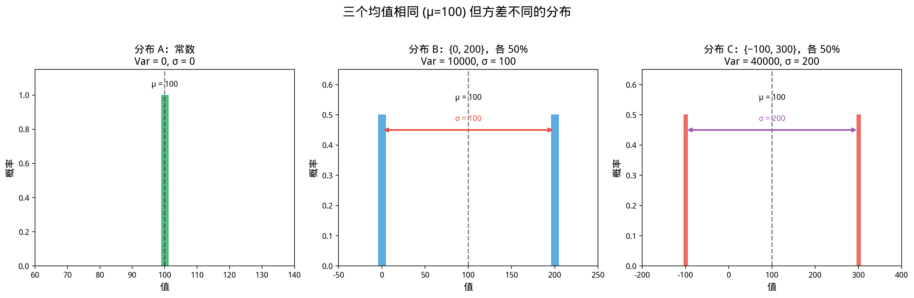

# §2 方差（Variance）

**前置知识**：[§1 数学期望](01-expectation.md)（期望的定义、线性性、LOTUS）

**全景图**：期望告诉我们分布的"中心"在哪里，但两个期望相同的分布可能形状完全不同——一个可能集中在均值附近，另一个可能非常分散。**方差**（variance）量化了这种"分散程度"。本节定义方差和标准差，推导方差的计算公式和性质，最后引入 **Chebyshev 不等式**——一个用方差估计概率的通用工具。

**预估学习时间**：约 4–5 小时

---

## 动机

考虑两个游戏：
- **游戏 A**：必定赢 $100$ 元。
- **游戏 B**：以 $50\%$ 概率赢 $0$ 元，$50\%$ 概率赢 $200$ 元。

两者的期望相同：$E[A] = E[B] = 100$。但游戏 B 更"冒险"——它的结果离均值更远。方差正是刻画这种"冒险程度"的量。

---

## 1. 方差的定义

### 1.1 定义

> **定义 1**（方差）
>
> 随机变量 $X$ 的**方差**（variance）定义为
>
> $$\text{Var}(X) = E\!\left[(X - \mu)^2\right]$$
>
> 其中 $\mu = E[X]$。也常记作 $\sigma^2$ 或 $\sigma_X^2$。

方差衡量了 $X$ 偏离其均值 $\mu$ 的"平均平方偏差"。

### 1.2 标准差

> **定义 2**（标准差）
>
> **标准差**（standard deviation）是方差的平方根：
>
> $$\sigma = \sqrt{\text{Var}(X)}$$

标准差与 $X$ 有相同的量纲（单位），因此在实际中更常用。例如 $X$ 的单位是"元"，则 $\text{Var}(X)$ 的单位是"元²"，而 $\sigma$ 的单位是"元"。

### 1.3 计算公式

> **定理 1**（方差的计算公式）
>
> $$\text{Var}(X) = E[X^2] - (E[X])^2$$

**证明**：

$$\text{Var}(X) = E[(X-\mu)^2] = E[X^2 - 2\mu X + \mu^2]$$

$$= E[X^2] - 2\mu E[X] + \mu^2 = E[X^2] - 2\mu^2 + \mu^2 = E[X^2] - \mu^2 \quad \blacksquare$$

这个公式的好处是：只需要计算 $E[X]$ 和 $E[X^2]$（通常用 LOTUS），不需要每次都从定义出发。

> **例 1**（骰子方差）
>
> $X$ = 公平骰子点数。$E[X] = 3.5$。
>
> $E[X^2] = (1+4+9+16+25+36)/6 = 91/6 \approx 15.17$。
>
> $\text{Var}(X) = 91/6 - (7/2)^2 = 91/6 - 49/4 = (182 - 147)/12 = 35/12 \approx 2.92$。
>
> $\sigma \approx 1.71$。

### 1.4 方差为零的含义

> **命题 1**：$\text{Var}(X) = 0$ 当且仅当 $X$ 是常数（$P(X = c) = 1$）。

直觉：如果 $X$ 完全没有"波动"，方差就是零。

---

## 2. 方差的性质

### 2.1 仿射变换

> **定理 2**：$\text{Var}(aX + b) = a^2 \text{Var}(X)$

**证明**：$E[aX+b] = aE[X] + b = a\mu + b$。

$$\text{Var}(aX+b) = E[(aX+b - a\mu - b)^2] = E[(a(X-\mu))^2] = a^2 E[(X-\mu)^2] = a^2 \text{Var}(X) \quad \blacksquare$$

**注意**：加常数 $b$ 不影响方差（平移不改变分散程度），乘以常数 $a$ 使方差乘以 $a^2$。

### 2.2 独立随机变量方差的可加性

> **定理 3**：若 $X$ 和 $Y$ **独立**，则
>
> $$\text{Var}(X + Y) = \text{Var}(X) + \text{Var}(Y)$$

**证明**：定义**协方差** $\text{Cov}(X,Y) = E[(X-\mu_X)(Y-\mu_Y)] = E[XY] - E[X]E[Y]$。

$$\text{Var}(X+Y) = E[(X+Y-\mu_X-\mu_Y)^2]$$
$$= E[(X-\mu_X)^2] + 2E[(X-\mu_X)(Y-\mu_Y)] + E[(Y-\mu_Y)^2]$$
$$= \text{Var}(X) + 2\text{Cov}(X,Y) + \text{Var}(Y)$$

独立时 $\text{Cov}(X,Y) = E[XY] - E[X]E[Y] = 0$，故 $\text{Var}(X+Y) = \text{Var}(X) + \text{Var}(Y)$。$\blacksquare$

### 2.3 推广

若 $X_1, X_2, \ldots, X_n$ **两两独立**（或更强：相互独立），则

$$\text{Var}\!\left(\sum_{i=1}^n X_i\right) = \sum_{i=1}^n \text{Var}(X_i)$$

若不独立，需加协方差项：

$$\text{Var}\!\left(\sum_{i=1}^n X_i\right) = \sum_{i=1}^n \text{Var}(X_i) + 2\sum_{i<j} \text{Cov}(X_i, X_j)$$

### 2.4 二项分布方差的推导

$X \sim B(n,p)$。$X = X_1 + \cdots + X_n$，$X_i$ 独立 Bernoulli($p$)。

$$\text{Var}(X) = \sum_{i=1}^n \text{Var}(X_i) = n \cdot p(1-p) = npq$$

> **例 2**（方差比较）
>
> 比较以下三个分布的方差：
> - $A$：$P(A = 100) = 1$
> - $B$：$P(B = 0) = P(B = 200) = 1/2$
> - $C$：$P(C = -100) = P(C = 300) = 1/2$

均值均为 $100$。

$\text{Var}(A) = 0$（常数）。

$\text{Var}(B) = E[B^2] - 100^2 = (0 + 40000)/2 - 10000 = 10000$，$\sigma_B = 100$。

$\text{Var}(C) = E[C^2] - 100^2 = (10000 + 90000)/2 - 10000 = 40000$，$\sigma_C = 200$。

分散程度：$A < B < C$。$\blacksquare$

---

## 3. 常见分布方差总结

| 分布 | $\text{Var}(X)$ |
|------|-----------------|
| $\text{Bernoulli}(p)$ | $p(1-p)$ |
| $B(n,p)$ | $np(1-p)$ |
| $\text{Geom}(p)$ | $(1-p)/p^2$ |
| $\text{Poi}(\lambda)$ | $\lambda$ |
| 均匀 $\{1,\ldots,n\}$ | $(n^2-1)/12$ |

---

## 4. Chebyshev 不等式（Chebyshev's Inequality）

### 4.1 动机

如果只知道 $E[X]$ 和 $\text{Var}(X)$，能否估计 $X$ 偏离均值很远的概率？Chebyshev 不等式给出了肯定的答案。

### 4.2 Markov 不等式（前置）

> **定理 4**（Markov 不等式）
>
> 若 $Y \geq 0$，则对任意 $a > 0$，
>
> $$P(Y \geq a) \leq \frac{E[Y]}{a}$$

**证明**：$E[Y] = \sum_y y \cdot P(Y = y) \geq \sum_{y \geq a} y \cdot P(Y = y) \geq a \sum_{y \geq a} P(Y = y) = a \cdot P(Y \geq a)$。$\blacksquare$

### 4.3 Chebyshev 不等式

> **定理 5**（Chebyshev 不等式）
>
> 对任意随机变量 $X$（有有限方差）和任意 $k > 0$，
>
> $$P(|X - \mu| \geq k\sigma) \leq \frac{1}{k^2}$$
>
> 等价地，
>
> $$P(|X - \mu| \geq t) \leq \frac{\sigma^2}{t^2}$$

**证明**：将 Markov 不等式应用于 $Y = (X - \mu)^2$，$a = t^2$：

$$P(|X-\mu| \geq t) = P((X-\mu)^2 \geq t^2) \leq \frac{E[(X-\mu)^2]}{t^2} = \frac{\sigma^2}{t^2} \quad \blacksquare$$

### 4.4 Chebyshev 不等式的含义

| $k$ | $P(\|X-\mu\| \geq k\sigma) \leq$ | 含义 |
|-----|----------------------------------|------|
| $2$ | $1/4 = 25\%$ | 偏离 $2\sigma$ 以上的概率 $\leq 25\%$ |
| $3$ | $1/9 \approx 11\%$ | 偏离 $3\sigma$ 以上的概率 $\leq 11\%$ |
| $4$ | $1/16 = 6.25\%$ | 偏离 $4\sigma$ 以上的概率 $\leq 6.25\%$ |
| $10$ | $1/100 = 1\%$ | 偏离 $10\sigma$ 以上的概率 $\leq 1\%$ |

Chebyshev 不等式的优点是**完全通用**——对任何分布都成立，只需要方差存在。缺点是界可能很松（对正态分布等"好"的分布，实际概率远小于 Chebyshev 给出的上界）。

> **例 3**（Chebyshev 应用）
>
> 某考试成绩 $X$ 满足 $E[X] = 70$，$\text{Var}(X) = 100$（$\sigma = 10$）。估计成绩在 $[50, 90]$ 之外的学生比例。

**解**：$|X - 70| \geq 20 = 2\sigma$。

由 Chebyshev：$P(|X - 70| \geq 20) \leq 1/4 = 25\%$。

至多 $25\%$ 的学生成绩在 $[50, 90]$ 之外。$\blacksquare$

### 4.5 Chebyshev 不等式与大数定律

Chebyshev 不等式是证明弱大数定律（Ch05）的关键工具。

---

## 5. 标准化（Standardization）

> **定义 3**（标准化随机变量）
>
> $$Z = \frac{X - \mu}{\sigma}$$
>
> 则 $E[Z] = 0$，$\text{Var}(Z) = 1$。

标准化消除了量纲和尺度的影响，使得不同的随机变量可以在相同的尺度上比较。

---

## 例题

> **例题 1**
>
> $X$ 的 PMF：$p(-1) = 0.3$，$p(0) = 0.4$，$p(2) = 0.3$。求 $E[X]$，$\text{Var}(X)$，$\sigma$。

**解**：$E[X] = (-1)(0.3) + 0(0.4) + 2(0.3) = -0.3 + 0 + 0.6 = 0.3$。

$E[X^2] = 1(0.3) + 0(0.4) + 4(0.3) = 0.3 + 0 + 1.2 = 1.5$。

$\text{Var}(X) = 1.5 - 0.3^2 = 1.5 - 0.09 = 1.41$。

$\sigma = \sqrt{1.41} \approx 1.187$。$\blacksquare$

> **例题 2**
>
> $X \sim \text{Poi}(25)$。用 Chebyshev 不等式估计 $P(15 \leq X \leq 35)$ 的下界。

**解**：$\mu = 25$，$\sigma^2 = 25$，$\sigma = 5$。

$P(|X - 25| \geq 10) \leq 25/100 = 1/4$。

因此 $P(15 \leq X \leq 35) = P(|X - 25| < 10) \geq 1 - 1/4 = 3/4 = 75\%$。$\blacksquare$

> **例题 3**
>
> 独立掷 $100$ 次公平硬币。$X$ = 正面次数。用 Chebyshev 不等式估计 $P(40 \leq X \leq 60)$。

**解**：$X \sim B(100, 0.5)$。$\mu = 50$，$\sigma^2 = 25$，$\sigma = 5$。

$P(|X - 50| \geq 10) \leq 25/100 = 1/4$。

$P(40 \leq X \leq 60) \geq 3/4 = 75\%$。

（实际概率约 $96.5\%$——Chebyshev 界确实比较松。）$\blacksquare$

---

## 要点回顾

| 概念 | 要点 |
|------|------|
| 方差 | $\text{Var}(X) = E[(X-\mu)^2] = E[X^2] - (E[X])^2$ |
| 标准差 | $\sigma = \sqrt{\text{Var}(X)}$，与 $X$ 同量纲 |
| 仿射变换 | $\text{Var}(aX+b) = a^2\text{Var}(X)$ |
| 独立可加 | $\text{Var}(X+Y) = \text{Var}(X)+\text{Var}(Y)$（需独立） |
| Chebyshev | $P(\|X-\mu\| \geq t) \leq \sigma^2/t^2$（通用但松） |
| 标准化 | $Z = (X-\mu)/\sigma$，$E[Z]=0$，$\text{Var}(Z)=1$ |

---

## 进度检查点

完成本节后，你应该能够：

- [ ] 用两种方法计算方差（定义 / 计算公式）
- [ ] 运用 $\text{Var}(aX+b) = a^2 \text{Var}(X)$
- [ ] 判断何时可以用方差可加性
- [ ] 运用 Chebyshev 不等式估计概率
- [ ] 对随机变量进行标准化

---

## 自测题

**题 1**：$X \sim \text{Bernoulli}(0.7)$。$\text{Var}(X)$？

答案

$\text{Var}(X) = 0.7 \times 0.3 = 0.21$。

**题 2**：$Y = 3X + 5$，$\text{Var}(X) = 4$。$\text{Var}(Y)$？$\sigma_Y$？

答案

$\text{Var}(Y) = 9 \times 4 = 36$。$\sigma_Y = 6$。

**题 3**：$X$ 和 $Y$ 独立，$\text{Var}(X) = 3$，$\text{Var}(Y) = 5$。$\text{Var}(2X - Y + 1)$？

答案

$\text{Var}(2X - Y + 1) = 4\text{Var}(X) + \text{Var}(Y) = 12 + 5 = 17$。

（常数 $+1$ 不影响方差，$-Y$ 的方差 $= (-1)^2 \text{Var}(Y) = \text{Var}(Y)$。）

**题 4**：$E[X] = 10$，$\text{Var}(X) = 9$。用 Chebyshev 估计 $P(|X-10| \geq 6)$。

答案

$P(|X-10| \geq 6) \leq 9/36 = 1/4$。

---

## 习题引用

本节的练习见 [exercises/exercises.md](exercises/exercises.md)。
