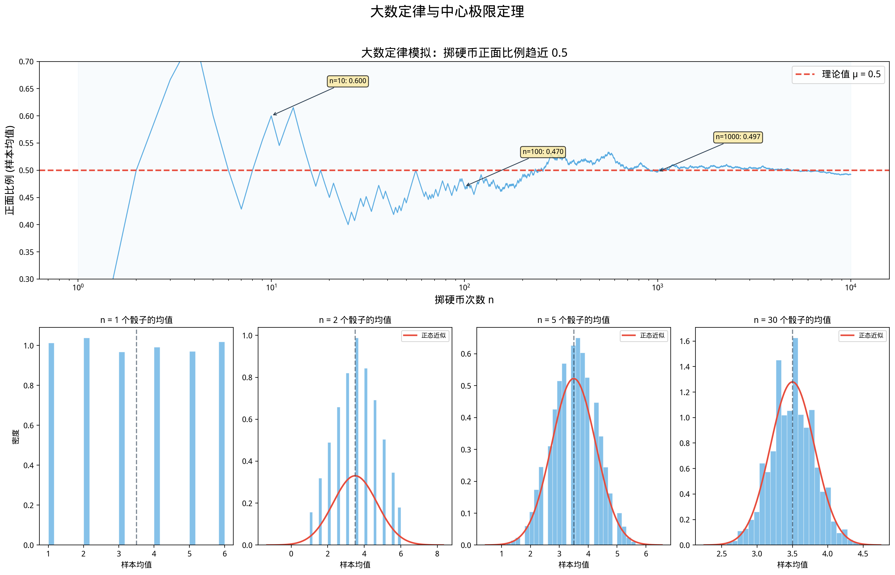

# §1 大数定律与中心极限定理初步（Law of Large Numbers & CLT Preview）[Bridge]

**前置知识**：[Part 8 第 3 章 随机变量与分布](../ch03-random-variables/README.md)（随机变量、二项分布）、[Part 8 第 4 章 期望与方差](../ch04-expectation-variance/README.md)（期望、方差、Chebyshev 不等式）、[Part 6 第 2 章 极限](../../part-06-analysis-prep/ch02-limits/README.md)（极限的概念）

**全景图**：本节是概率论最深刻的定理之一——大数定律——的入门。我们先通过模拟实验建立直觉，然后用 Chebyshev 不等式给出弱大数定律的严格证明，再陈述（不证明）强大数定律。接着介绍 Monte Carlo 模拟的核心思想。最后预览中心极限定理——它不仅告诉我们"偏差趋于零"，还精确描述了"偏差的分布"。本节作为 Bridge，为未来的统计学和高级概率论学习铺路。

**预估学习时间**：约 6–8 小时

---

## 动机

赌场为什么总是赢？

并不是每个赌徒每次都输——有人确实赢了大钱。但赌场的优势在于**大量的游戏**。即使每局赌场的优势微小（比如轮盘赌中庄家优势约 $2.7\%$），大数定律保证了在成千上万局之后，赌场的利润几乎确定地接近理论预期值。

**个体是不可预测的，整体是可预测的**——这就是大数定律的本质。

---

## 1. 样本均值（Sample Mean）

### 1.1 设置

设 $X_1, X_2, \ldots, X_n$ 是**独立同分布**（independent and identically distributed, i.i.d.）的随机变量，共同的均值 $E[X_i] = \mu$，方差 $\text{Var}(X_i) = \sigma^2$。

定义**样本均值**（sample mean）：

$$\bar{X}_n = \frac{X_1 + X_2 + \cdots + X_n}{n} = \frac{1}{n}\sum_{i=1}^n X_i$$

### 1.2 样本均值的期望和方差

$$E[\bar{X}_n] = \frac{1}{n} \sum_{i=1}^n E[X_i] = \frac{n\mu}{n} = \mu$$

$$\text{Var}(\bar{X}_n) = \frac{1}{n^2} \sum_{i=1}^n \text{Var}(X_i) = \frac{n\sigma^2}{n^2} = \frac{\sigma^2}{n}$$

**关键观察**：
- 样本均值的期望始终等于总体均值 $\mu$（**无偏性**）。
- 样本均值的方差等于 $\sigma^2/n$——随着 $n$ 增大，方差趋于 $0$。

这意味着 $\bar{X}_n$ 越来越集中在 $\mu$ 附近。大数定律就是这个观察的精确陈述。

---

## 2. 弱大数定律（Weak Law of Large Numbers）

### 2.1 陈述

> **定理 1**（弱大数定律 / Weak LLN）
>
> 设 $X_1, X_2, \ldots$ 是 i.i.d. 随机变量，$E[X_i] = \mu$，$\text{Var}(X_i) = \sigma^2 < \infty$。则对任意 $\epsilon > 0$，
>
> $$\lim_{n \to \infty} P\!\left(|\bar{X}_n - \mu| \geq \epsilon\right) = 0$$

用概率论的术语说，$\bar{X}_n$ **依概率收敛**（converges in probability）到 $\mu$，记作 $\bar{X}_n \xrightarrow{P} \mu$。

### 2.2 Chebyshev 证明

**证明**：由 Chebyshev 不等式：

$$P(|\bar{X}_n - \mu| \geq \epsilon) \leq \frac{\text{Var}(\bar{X}_n)}{\epsilon^2} = \frac{\sigma^2}{n\epsilon^2}$$

当 $n \to \infty$ 时，$\sigma^2/(n\epsilon^2) \to 0$。

因此 $P(|\bar{X}_n - \mu| \geq \epsilon) \to 0$。$\blacksquare$

**这个证明的优美之处**：它只用到了 Chebyshev 不等式——而 Chebyshev 不等式只需要方差存在。整个证明只有几行！

### 2.3 直觉理解

弱大数定律说的是：对于**任意给定的精度** $\epsilon$（无论多小），只要 $n$ 足够大，$\bar{X}_n$ 偏离 $\mu$ 超过 $\epsilon$ 的概率可以任意小。

**定量估计**：要保证 $P(|\bar{X}_n - \mu| \geq \epsilon) \leq \delta$，需要

$$n \geq \frac{\sigma^2}{\epsilon^2 \delta}$$

> **例 1**（掷硬币）
>
> $X_i \sim \text{Bernoulli}(0.5)$，$\mu = 0.5$，$\sigma^2 = 0.25$。
>
> 要求正面比例与 $0.5$ 的偏差不超过 $0.01$，且概率至少 $99\%$：
>
> $n \geq 0.25 / (0.01^2 \times 0.01) = 250{,}000$。
>
> 需要至少 $250{,}000$ 次掷硬币。

（Chebyshev 估计比较保守。实际上，由中心极限定理，约 $n = 17{,}000$ 就够了。）

---

## 3. 强大数定律（Strong Law of Large Numbers）

### 3.1 陈述

> **定理 2**（强大数定律 / Strong LLN / Kolmogorov）
>
> 设 $X_1, X_2, \ldots$ 是 i.i.d. 随机变量，$E[X_i] = \mu$（不需要方差有限！只需均值存在）。则
>
> $$P\!\left(\lim_{n \to \infty} \bar{X}_n = \mu\right) = 1$$

即 $\bar{X}_n$ **几乎必然收敛**（almost surely converges）到 $\mu$，记作 $\bar{X}_n \xrightarrow{a.s.} \mu$。

### 3.2 弱 vs 强

| | 弱大数定律 | 强大数定律 |
|---|---|---|
| 收敛类型 | 依概率收敛 | 几乎必然收敛 |
| 条件 | 需要 $\sigma^2 < \infty$ | 只需 $E[\|X\|] < \infty$ |
| 含义 | 对每个 $\epsilon$，大偏差的概率趋于 $0$ | 整条样本路径趋于 $\mu$ |

几乎必然收敛是更强的条件——它意味着随机序列 $\bar{X}_1, \bar{X}_2, \ldots$ 的**整条轨道**最终收敛到 $\mu$，而不仅仅是"概率趋于零"。

强大数定律的证明需要更深入的技术（Borel-Cantelli 引理等），超出本书范围。

### 3.3 频率解释的数学保障

大数定律为概率的**频率解释**提供了严格的数学基础。

设 $A$ 是事件，$P(A) = p$。定义 $X_i = 1_A$（$A$ 在第 $i$ 次发生时为 $1$，否则为 $0$）。则

$$\bar{X}_n = \frac{\text{$A$ 在 $n$ 次中发生的次数}}{n} = \text{$A$ 的相对频率}$$

大数定律：$\bar{X}_n \to p$（$n \to \infty$）。

即**相对频率趋近于概率**——这正是频率解释的核心主张。

---

## 4. Monte Carlo 模拟（Monte Carlo Simulation）

### 4.1 核心思想

大数定律直接导出了一种强大的计算方法——**Monte Carlo 模拟**：

> **要计算 $E[g(X)]$，只需独立生成 $X_1, \ldots, X_n$，然后用样本均值 $\frac{1}{n}\sum g(X_i)$ 近似。**

当 $n$ 足够大时，大数定律保证近似是准确的。

### 4.2 用 Monte Carlo 估计 $\pi$

经典例子：在 $[0,1] \times [0,1]$ 的正方形内随机撒点。落在单位圆内（$x^2 + y^2 \leq 1$ 的四分之一圆内）的比例 $\approx \pi/4$。

$$\hat{\pi}_n = 4 \times \frac{\text{落在四分之一圆内的点数}}{n}$$

由大数定律，$\hat{\pi}_n \to \pi$（$n \to \infty$）。

### 4.3 Monte Carlo 的误差

$\hat{\pi}_n$ 的标准差 $\approx \sigma / \sqrt{n}$。要将精度提高 $10$ 倍，需要 $100$ 倍的样本量——这是 Monte Carlo 方法的基本特点。

> **例 2**（估计概率）
>
> 掷 $5$ 个骰子，点数之和超过 $20$ 的概率是多少？
>
> 解析计算需要复杂的计数。但 Monte Carlo 很简单：
> 1. 独立掷 $5$ 个骰子 $n$ 次（比如 $n = 100{,}000$）
> 2. 统计其中点数之和 $> 20$ 的次数 $m$
> 3. 估计概率 $\hat{p} = m/n$
>
> 大数定律保证 $\hat{p} \to P(\text{和} > 20)$。

---

## 5. 中心极限定理预览（CLT Preview）

### 5.1 大数定律的局限

大数定律告诉我们 $\bar{X}_n \to \mu$，但没有告诉我们**偏差 $\bar{X}_n - \mu$ 的大小和分布**。

### 5.2 标准化

定义标准化的样本均值：

$$Z_n = \frac{\bar{X}_n - \mu}{\sigma / \sqrt{n}} = \frac{\sum_{i=1}^n X_i - n\mu}{\sigma\sqrt{n}}$$

$Z_n$ 满足 $E[Z_n] = 0$，$\text{Var}(Z_n) = 1$。

### 5.3 中心极限定理

> **定理 3**（中心极限定理 / Central Limit Theorem, CLT）
>
> 设 $X_1, X_2, \ldots$ 是 i.i.d. 随机变量，$E[X_i] = \mu$，$\text{Var}(X_i) = \sigma^2 \in (0, \infty)$。则
>
> $$Z_n = \frac{\bar{X}_n - \mu}{\sigma/\sqrt{n}} \xrightarrow{d} N(0, 1) \quad (n \to \infty)$$
>
> 即对任意 $z \in \mathbb{R}$，
>
> $$\lim_{n \to \infty} P(Z_n \leq z) = \Phi(z) = \frac{1}{\sqrt{2\pi}} \int_{-\infty}^{z} e^{-t^2/2} \, dt$$

这里 $N(0,1)$ 是**标准正态分布**（standard normal distribution），$\Phi(z)$ 是其 CDF。

### 5.4 CLT 的意义

1. **普适性**：无论 $X_i$ 是什么分布（二项、Poisson、均匀……），标准化后的和都趋向正态分布。这解释了为什么正态分布在自然界中无处不在——很多随机现象是大量独立小效应的叠加。

2. **实用近似**：当 $n$ 较大时，

$$\bar{X}_n \approx N\!\left(\mu, \frac{\sigma^2}{n}\right)$$

$$\sum_{i=1}^n X_i \approx N(n\mu, n\sigma^2)$$

3. **二项分布的正态近似**：$X \sim B(n, p)$ 时，$n$ 大时

$$\frac{X - np}{\sqrt{np(1-p)}} \approx N(0, 1)$$

这是 CLT 的最常用特例。

### 5.5 直方图可视化

CLT 的美妙之处可以通过模拟直观感受：

- 掷 $1$ 个骰子：分布是均匀的（完全不像正态分布）
- 掷 $2$ 个骰子取平均：三角形分布（开始有峰值）
- 掷 $10$ 个骰子取平均：已经相当接近正态分布
- 掷 $30$ 个骰子取平均：几乎与正态分布无法区分

### 5.6 CLT 的历史

CLT 的雏形可以追溯到 de Moivre（1733），他证明了二项分布的正态近似。Laplace 将其推广到更一般的情况。Lyapunov（1901）给出了第一个严格的一般性证明。Lindeberg-Lévy（1920s）给出了经典的 i.i.d. 版本——也就是我们陈述的版本。

CLT 被认为是"概率论中最重要的定理"之一。

---

## 6. 暂认与兑现

在本部分中，我们做了以下**暂认**（IOUs）：

| 暂认内容 | 当前状态 | 何时兑现 |
|----------|---------|---------|
| 强大数定律的证明 | 已陈述定理 | 大学概率论课程（测度论基础） |
| 中心极限定理的证明 | 已陈述定理 | 大学概率论课程（特征函数方法） |
| 连续随机变量与正态分布 | 已提及 | 大学概率论 / 统计学 |
| Lebesgue 积分下的期望 | 已提及 | 实分析 / 测度论 |

我们在本部分**兑现**了以下 Part 7 的预告：

| 兑现内容 | 来源 |
|----------|------|
| 古典概型使用排列组合 | Part 7 Ch01–Ch03 |
| 二项分布使用二项式定理 | Part 7 Ch03 |
| 容斥原理的概率版本 | Part 7 Ch01 §2 |

---

## 例题

> **例题 1**
>
> 掷公平硬币 $400$ 次。用弱大数定律（Chebyshev 估计）和 CLT 分别估计正面次数在 $[180, 220]$ 之间的概率。

**解**：$X \sim B(400, 0.5)$，$\mu = 200$，$\sigma^2 = 100$，$\sigma = 10$。

**Chebyshev**：$P(|X - 200| \geq 20) \leq 100/400 = 1/4$。

$P(180 \leq X \leq 220) \geq 3/4 = 75\%$。

**CLT**：$Z = (X - 200)/10$，$P(180 \leq X \leq 220) = P(-2 \leq Z \leq 2) \approx \Phi(2) - \Phi(-2) = 0.9772 - 0.0228 = 0.9544$。

CLT 给出约 $95.4\%$——比 Chebyshev 的 $75\%$ 精确得多。$\blacksquare$

> **例题 2**
>
> 某保险公司有 $10{,}000$ 个保单，每个保单的年理赔额独立同分布，均值 $\mu = 500$ 元，标准差 $\sigma = 800$ 元。用 CLT 估计总理赔额超过 $520$ 万元的概率。

**解**：$S = \sum_{i=1}^{10000} X_i$，$E[S] = 500 \times 10000 = 500$ 万元。

$\text{Var}(S) = 10000 \times 800^2 = 640{,}000$ 万元²，$\sigma_S = 800\sqrt{10000}/10000 \cdot 10000 = 8$ 万元。

$P(S > 520\text{万}) = P\!\left(\frac{S - 500}{8} > \frac{20}{8}\right) = P(Z > 2.5) \approx 1 - \Phi(2.5) \approx 0.0062$。

约 $0.6\%$ 的概率总理赔超过 $520$ 万元。$\blacksquare$

---

## 要点回顾

| 概念 | 要点 |
|------|------|
| 弱大数定律 | $\bar{X}_n \xrightarrow{P} \mu$，Chebyshev 证明 |
| 强大数定律 | $\bar{X}_n \xrightarrow{a.s.} \mu$，需更深技术 |
| 收敛速度 | $\text{Var}(\bar{X}_n) = \sigma^2/n$，误差 $\sim 1/\sqrt{n}$ |
| Monte Carlo | 用随机抽样近似期望，大数定律保证收敛 |
| CLT | 标准化的和趋向正态分布，普适性极强 |
| 频率→概率 | 大数定律为频率解释提供数学保障 |

---

## 进度检查点

完成本节后，你应该能够：

- [ ] 陈述弱大数定律并用 Chebyshev 不等式证明
- [ ] 区分弱收敛和强收敛
- [ ] 计算样本均值的期望和方差
- [ ] 解释 Monte Carlo 模拟的原理
- [ ] 陈述中心极限定理并给出直觉解释
- [ ] 用 CLT 进行正态近似

---

## 自测题

**题 1**：$X_i$ i.i.d.，$E[X_i] = 3$，$\text{Var}(X_i) = 16$。$\bar{X}_{100}$ 的期望和方差？

答案

$E[\bar{X}_{100}] = 3$。$\text{Var}(\bar{X}_{100}) = 16/100 = 0.16$。

**题 2**：用 Chebyshev 估计 $P(|\bar{X}_{100} - 3| \geq 1)$（接上题）。

答案

$P(|\bar{X}_{100} - 3| \geq 1) \leq 0.16/1^2 = 0.16 = 16\%$。

**题 3**：$X \sim B(900, 0.5)$。用 CLT 近似 $P(X \geq 470)$。

答案

$\mu = 450$，$\sigma = \sqrt{225} = 15$。

$P(X \geq 470) = P(Z \geq (470-450)/15) = P(Z \geq 4/3) \approx 1 - \Phi(1.33) \approx 0.092$。

**题 4**：为什么 Monte Carlo 方法精度提高 $10$ 倍需要 $100$ 倍的样本？

答案

误差 $\propto \sigma/\sqrt{n}$。精度提高 $10$ 倍即误差缩小到 $1/10$，需要 $\sqrt{n}$ 增大 $10$ 倍，即 $n$ 增大 $100$ 倍。

---

## 习题引用

本节的练习见 [exercises/exercises.md](exercises/exercises.md)。
