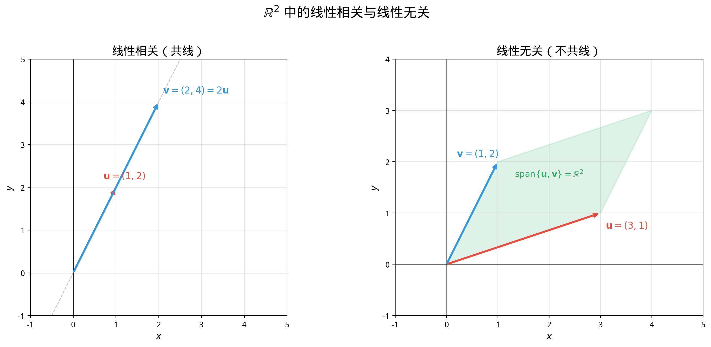
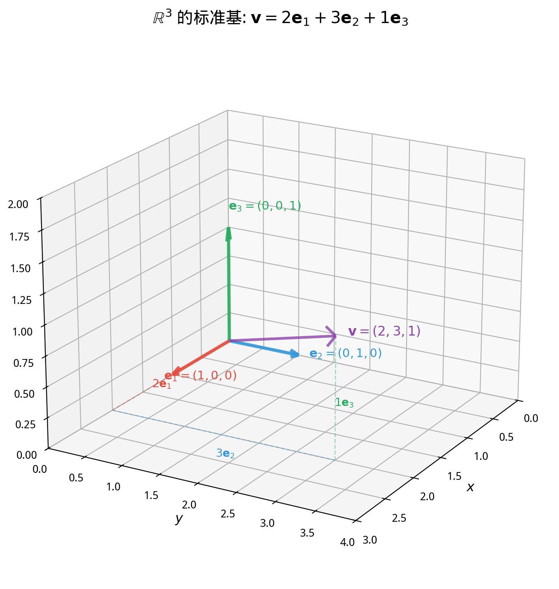

# §2 线性无关与基（Linear Independence & Basis）[Bridge]

**前置知识**：[§1 向量空间的直觉](01-vector-space-intuition.md)（向量空间公理、$\mathbb{R}^n$、子空间）、[Part 3 代数](../../part-03-algebra/README.md)（方程求解）

**全景图**：在上一节，我们知道了什么是向量空间和子空间。但一个向量空间可能包含无穷多个向量——我们能否找到一组"最小的"向量，使得空间中的每一个向量都能用它们"拼出来"？这就是**基**（basis）的概念。为了找到基，我们需要先理解**线性组合**（怎样"拼"向量）和**线性无关**（哪些向量是"不冗余的"）。这些概念是线性代数的核心词汇——矩阵的秩（Ch03）、行列式的几何意义（Ch04）都依赖于它们。

**预估学习时间**：约 4–5 小时

---

## 动机

在 $\mathbb{R}^2$ 中，两个向量 $\mathbf{e}_1 = (1, 0)$ 和 $\mathbf{e}_2 = (0, 1)$ 有一个特殊性质：平面上**任何**向量都可以唯一地写成它们的"线性组合"：

$$(x, y) = x \mathbf{e}_1 + y \mathbf{e}_2$$

换句话说，$\mathbf{e}_1$ 和 $\mathbf{e}_2$ "生成"了整个 $\mathbb{R}^2$，而且它们之间没有冗余——去掉任何一个，就无法表示所有向量了。

但如果加入第三个向量 $\mathbf{v} = (1, 1)$，情况就变了：$\mathbf{v} = \mathbf{e}_1 + \mathbf{e}_2$，所以 $\mathbf{v}$ 是"多余的"。三个向量仍然能生成整个 $\mathbb{R}^2$，但不再是"最精简"的生成集。

本节的目标：精确定义"线性组合"、"生成"、"不冗余"和"最精简的生成集"——即**线性组合**、**张成空间**、**线性无关**和**基**。

---

## 1. 线性组合（Linear Combination）

> **定义 1**（线性组合）
>
> 设 $V$ 是一个向量空间，$\mathbf{v}_1, \mathbf{v}_2, \ldots, \mathbf{v}_k \in V$。向量
>
> $$\mathbf{w} = c_1 \mathbf{v}_1 + c_2 \mathbf{v}_2 + \cdots + c_k \mathbf{v}_k, \quad c_1, c_2, \ldots, c_k \in \mathbb{R}$$
>
> 称为 $\mathbf{v}_1, \ldots, \mathbf{v}_k$ 的一个**线性组合**（linear combination）。标量 $c_1, \ldots, c_k$ 称为**系数**（coefficients）。

**关键**：线性组合只涉及两种运算——**标量乘法**和**加法**。没有乘方、没有乘积、没有其他非线性操作。

**例子**：

在 $\mathbb{R}^3$ 中，$\mathbf{v}_1 = (1, 0, 2)$，$\mathbf{v}_2 = (0, 1, -1)$。则：

$$3\mathbf{v}_1 + 2\mathbf{v}_2 = 3(1, 0, 2) + 2(0, 1, -1) = (3, 0, 6) + (0, 2, -2) = (3, 2, 4)$$

所以 $(3, 2, 4)$ 是 $\mathbf{v}_1, \mathbf{v}_2$ 的一个线性组合。

**问题**：$(1, 2, 3)$ 是否为 $\mathbf{v}_1, \mathbf{v}_2$ 的线性组合？需要求解 $c_1(1,0,2) + c_2(0,1,-1) = (1,2,3)$，即：

$$c_1 = 1, \quad c_2 = 2, \quad 2c_1 - c_2 = 3$$

第三个方程：$2(1) - 2 = 0 \neq 3$。矛盾！所以 $(1, 2, 3)$ **不是** $\mathbf{v}_1, \mathbf{v}_2$ 的线性组合。

---

## 2. 张成空间（Span）

> **定义 2**（张成空间）
>
> 设 $\mathbf{v}_1, \ldots, \mathbf{v}_k \in V$。它们的所有线性组合构成的集合称为 $\mathbf{v}_1, \ldots, \mathbf{v}_k$ 的**张成空间**（span）：
>
> $$\text{span}(\mathbf{v}_1, \ldots, \mathbf{v}_k) = \{c_1 \mathbf{v}_1 + \cdots + c_k \mathbf{v}_k : c_1, \ldots, c_k \in \mathbb{R}\}$$

> **命题 1**
>
> $\text{span}(\mathbf{v}_1, \ldots, \mathbf{v}_k)$ 是 $V$ 的子空间。

**证明**：
- **零向量**：取 $c_1 = \cdots = c_k = 0$，得 $\mathbf{0} \in \text{span}$。✓
- **加法封闭**：$(c_1\mathbf{v}_1 + \cdots + c_k\mathbf{v}_k) + (d_1\mathbf{v}_1 + \cdots + d_k\mathbf{v}_k) = (c_1+d_1)\mathbf{v}_1 + \cdots + (c_k+d_k)\mathbf{v}_k \in \text{span}$。✓
- **标量乘法封闭**：$\alpha(c_1\mathbf{v}_1 + \cdots + c_k\mathbf{v}_k) = (\alpha c_1)\mathbf{v}_1 + \cdots + (\alpha c_k)\mathbf{v}_k \in \text{span}$。✓ $\blacksquare$

**直觉**：$\text{span}(\mathbf{v}_1, \ldots, \mathbf{v}_k)$ 是包含 $\mathbf{v}_1, \ldots, \mathbf{v}_k$ 的**最小子空间**。

**几何直觉**（在 $\mathbb{R}^3$ 中）：

| 情形 | 张成空间 |
|------|----------|
| $\text{span}(\mathbf{0})$ | $\{\mathbf{0}\}$（原点） |
| $\text{span}(\mathbf{v})$（$\mathbf{v} \neq \mathbf{0}$） | 过原点的直线 |
| $\text{span}(\mathbf{v}_1, \mathbf{v}_2)$（$\mathbf{v}_1, \mathbf{v}_2$ 不共线） | 过原点的平面 |
| $\text{span}(\mathbf{v}_1, \mathbf{v}_2, \mathbf{v}_3)$（三者不共面） | 整个 $\mathbb{R}^3$ |

---

## 3. 线性无关与线性相关（Linear Independence vs Dependence）

### 3.1 定义

> **定义 3**（线性无关 / 线性相关）
>
> 向量组 $\mathbf{v}_1, \ldots, \mathbf{v}_k \in V$ 称为**线性无关**（linearly independent），如果方程
>
> $$c_1 \mathbf{v}_1 + c_2 \mathbf{v}_2 + \cdots + c_k \mathbf{v}_k = \mathbf{0}$$
>
> 只有**平凡解** $c_1 = c_2 = \cdots = c_k = 0$。
>
> 否则，称它们为**线性相关**（linearly dependent）——即存在不全为零的系数使得上式成立。

**直觉**：线性无关意味着"没有向量是多余的"——没有任何一个向量可以被其他向量的线性组合表示。

> **命题 2**
>
> $\mathbf{v}_1, \ldots, \mathbf{v}_k$ 线性相关当且仅当其中至少有一个向量可以写成其余向量的线性组合。

**证明**：

$(\Rightarrow)$：设 $c_1\mathbf{v}_1 + \cdots + c_k\mathbf{v}_k = \mathbf{0}$，其中某个 $c_j \neq 0$。则：

$$\mathbf{v}_j = -\frac{c_1}{c_j}\mathbf{v}_1 - \cdots - \frac{c_{j-1}}{c_j}\mathbf{v}_{j-1} - \frac{c_{j+1}}{c_j}\mathbf{v}_{j+1} - \cdots - \frac{c_k}{c_j}\mathbf{v}_k$$

$(\Leftarrow)$：若 $\mathbf{v}_j = d_1\mathbf{v}_1 + \cdots + d_{j-1}\mathbf{v}_{j-1} + d_{j+1}\mathbf{v}_{j+1} + \cdots + d_k\mathbf{v}_k$，则：

$$d_1\mathbf{v}_1 + \cdots + d_{j-1}\mathbf{v}_{j-1} + (-1)\mathbf{v}_j + d_{j+1}\mathbf{v}_{j+1} + \cdots + d_k\mathbf{v}_k = \mathbf{0}$$

系数不全为零（$\mathbf{v}_j$ 的系数为 $-1$）。$\blacksquare$

### 3.2 几何意义

在 $\mathbb{R}^2$ 中：

- **两个向量线性相关** $\Leftrightarrow$ 它们**共线**（一个是另一个的标量倍）。

  

- **两个向量线性无关** $\Leftrightarrow$ 它们**不共线**，此时它们张成整个 $\mathbb{R}^2$。

在 $\mathbb{R}^3$ 中：

- **三个向量线性相关** $\Leftrightarrow$ 它们**共面**。
- **三个向量线性无关** $\Leftrightarrow$ 它们**不共面**，此时它们张成整个 $\mathbb{R}^3$。

### 3.3 判定方法

对于 $\mathbb{R}^n$ 中的向量组，判定线性无关性归结为**解齐次线性方程组**。

设 $\mathbf{v}_1, \ldots, \mathbf{v}_k \in \mathbb{R}^n$。方程 $c_1\mathbf{v}_1 + \cdots + c_k\mathbf{v}_k = \mathbf{0}$ 是一个齐次线性方程组——如果只有平凡解，则线性无关；如果有非平凡解，则线性相关。

**快速判断规则**：

1. 如果 $k > n$（向量个数 > 空间维数），则**一定线性相关**。
2. 单个非零向量**一定线性无关**。
3. 含零向量的向量组**一定线性相关**（取零向量的系数为 $1$，其余为 $0$）。

---

## 4. 基和维数（Basis and Dimension）

### 4.1 基的定义

> **定义 4**（基）
>
> 设 $V$ 是向量空间。$V$ 的一组**基**（basis，复数 bases）是一个向量组 $\mathcal{B} = \{\mathbf{v}_1, \ldots, \mathbf{v}_n\}$，满足：
> 1. $\mathbf{v}_1, \ldots, \mathbf{v}_n$ **线性无关**；
> 2. $\text{span}(\mathbf{v}_1, \ldots, \mathbf{v}_n) = V$（**生成整个空间**）。

**直觉**：基是"最精简的生成集"——足够多（能表示所有向量），又没有冗余（不能去掉任何一个）。

### 4.2 标准基

> **定义 5**（标准基）
>
> $\mathbb{R}^n$ 的**标准基**（standard basis）是：
>
> $$\mathbf{e}_1 = \begin{pmatrix} 1 \\ 0 \\ \vdots \\ 0 \end{pmatrix}, \quad \mathbf{e}_2 = \begin{pmatrix} 0 \\ 1 \\ \vdots \\ 0 \end{pmatrix}, \quad \ldots, \quad \mathbf{e}_n = \begin{pmatrix} 0 \\ 0 \\ \vdots \\ 1 \end{pmatrix}$$

**验证**：

1. **线性无关**：若 $c_1\mathbf{e}_1 + \cdots + c_n\mathbf{e}_n = \mathbf{0}$，则 $(c_1, c_2, \ldots, c_n) = (0, 0, \ldots, 0)$。✓
2. **生成 $\mathbb{R}^n$**：$(x_1, \ldots, x_n) = x_1\mathbf{e}_1 + \cdots + x_n\mathbf{e}_n$。✓

**标准基不是唯一的基**。例如 $\mathbb{R}^2$ 的另一组基：

$$\mathbf{b}_1 = \begin{pmatrix} 1 \\ 1 \end{pmatrix}, \quad \mathbf{b}_2 = \begin{pmatrix} 1 \\ -1 \end{pmatrix}$$

验证：线性无关（不共线，因为 $\mathbf{b}_1 \neq c \mathbf{b}_2$）；生成 $\mathbb{R}^2$（对任意 $(x, y)$，解 $c_1 + c_2 = x$，$c_1 - c_2 = y$，得 $c_1 = (x+y)/2$，$c_2 = (x-y)/2$）。

### 4.3 基的表示唯一性

> **定理 2**（坐标唯一性）
>
> 设 $\mathcal{B} = \{\mathbf{v}_1, \ldots, \mathbf{v}_n\}$ 是向量空间 $V$ 的一组基。则 $V$ 中每个向量 $\mathbf{w}$ 可以**唯一地**写成 $\mathbf{v}_1, \ldots, \mathbf{v}_n$ 的线性组合。

**证明**：

**存在性**由 $\text{span}(\mathbf{v}_1, \ldots, \mathbf{v}_n) = V$ 保证。

**唯一性**：假设 $\mathbf{w} = c_1\mathbf{v}_1 + \cdots + c_n\mathbf{v}_n = d_1\mathbf{v}_1 + \cdots + d_n\mathbf{v}_n$。则：

$$(c_1 - d_1)\mathbf{v}_1 + \cdots + (c_n - d_n)\mathbf{v}_n = \mathbf{0}$$

由线性无关性，$c_i - d_i = 0$，即 $c_i = d_i$（$i = 1, \ldots, n$）。$\blacksquare$

系数 $(c_1, \ldots, c_n)$ 称为 $\mathbf{w}$ 在基 $\mathcal{B}$ 下的**坐标**（coordinates）。

### 4.4 $P_n$ 的基

多项式空间 $P_n$ 的标准基是 $\{1, x, x^2, \ldots, x^n\}$。

验证：
1. **线性无关**：$c_0 + c_1 x + \cdots + c_n x^n = 0$（恒等于零）当且仅当所有 $c_i = 0$。✓
2. **生成 $P_n$**：$P_n$ 的定义就是这些多项式的所有线性组合。✓

---

## 5. 维数（Dimension）

### 5.1 维数定理

不同的基可能看起来很不一样，但它们有一个惊人的共同点：

> **定理 3**（维数定理，Dimension Theorem）
>
> 向量空间 $V$ 的任意两组基包含**相同数目**的向量。

**证明思路**（交换论证）：

设 $\mathcal{B}_1 = \{\mathbf{u}_1, \ldots, \mathbf{u}_m\}$ 和 $\mathcal{B}_2 = \{\mathbf{v}_1, \ldots, \mathbf{v}_n\}$ 都是 $V$ 的基。

假设 $m < n$。因为 $\mathcal{B}_1$ 是基，每个 $\mathbf{v}_i$ 都可以写成 $\mathbf{u}_1, \ldots, \mathbf{u}_m$ 的线性组合。但 $n > m$ 个向量表示为 $m$ 个向量的线性组合时，根据齐次方程组的理论（Ch03 将详细讨论），它们一定线性相关——这与 $\mathcal{B}_2$ 线性无关矛盾。所以 $m \geq n$。

交换 $\mathcal{B}_1$ 和 $\mathcal{B}_2$ 的角色，同理 $n \geq m$。因此 $m = n$。$\blacksquare$

> **定义 6**（维数）
>
> 向量空间 $V$ 的基中向量的个数称为 $V$ 的**维数**（dimension），记作 $\dim V$。

**常见向量空间的维数**：

| 向量空间 | 维数 |
|----------|------|
| $\mathbb{R}^n$ | $n$ |
| $P_n$ | $n + 1$ |
| $\{\mathbf{0}\}$（零空间） | $0$ |
| 所有 $m \times n$ 矩阵 | $mn$ |

### 5.2 维数与线性无关、生成的关系

> **推论 1**
>
> 设 $\dim V = n$。则：
> 1. $V$ 中任何 $n + 1$ 个以上的向量一定**线性相关**。
> 2. $V$ 中少于 $n$ 个向量不可能**生成** $V$。
> 3. $V$ 中 $n$ 个线性无关的向量自动构成基。
> 4. $V$ 中 $n$ 个能生成 $V$ 的向量自动构成基。

**直觉**：维数是向量空间的"自由度"。$\mathbb{R}^3$ 有 $3$ 个自由度——需要恰好 $3$ 个不共面的向量来描述空间中的每一个点。

---

## 例题

### 例题 1：判断线性无关性

> **题目**：判断 $\mathbb{R}^3$ 中的向量组 $\mathbf{v}_1 = (1, 2, 3)$，$\mathbf{v}_2 = (4, 5, 6)$，$\mathbf{v}_3 = (7, 8, 9)$ 是否线性无关。

**解答**：

设 $c_1\mathbf{v}_1 + c_2\mathbf{v}_2 + c_3\mathbf{v}_3 = \mathbf{0}$，即：

$$c_1 + 4c_2 + 7c_3 = 0$$
$$2c_1 + 5c_2 + 8c_3 = 0$$
$$3c_1 + 6c_2 + 9c_3 = 0$$

从第二行减去第一行的 $2$ 倍：$-3c_2 - 6c_3 = 0$，即 $c_2 = -2c_3$。

从第三行减去第一行的 $3$ 倍：$-6c_2 - 12c_3 = 0$，即 $c_2 = -2c_3$（同样的方程）。

取 $c_3 = 1$，则 $c_2 = -2$，$c_1 = -4(-2) - 7(1) + 0 = 8 - 7 = 1$。

验证：$1 \cdot (1,2,3) + (-2)(4,5,6) + 1 \cdot (7,8,9) = (1-8+7, 2-10+8, 3-12+9) = (0, 0, 0)$。✓

存在非平凡解 $(c_1, c_2, c_3) = (1, -2, 1)$，所以 $\mathbf{v}_1, \mathbf{v}_2, \mathbf{v}_3$ **线性相关**。

几何意义：$\mathbf{v}_3 = -\mathbf{v}_1 + 2\mathbf{v}_2$，三个向量共面。$\blacksquare$

### 例题 2：找一组基

> **题目**：求 $W = \{(x, y, z) \in \mathbb{R}^3 : x + y - z = 0\}$ 的一组基和维数。

**解答**：

由 $x + y - z = 0$ 得 $z = x + y$。令 $x = s$，$y = t$（自由变量），则：

$$(x, y, z) = (s, t, s + t) = s(1, 0, 1) + t(0, 1, 1)$$

所以 $W = \text{span}\{(1, 0, 1), (0, 1, 1)\}$。

$(1, 0, 1)$ 和 $(0, 1, 1)$ 线性无关（因为它们不共线：一个不是另一个的标量倍），所以 $\{(1, 0, 1), (0, 1, 1)\}$ 是 $W$ 的一组基。

$\dim W = 2$。

几何意义：$W$ 是 $\mathbb{R}^3$ 中过原点的一个平面（二维子空间）。$\blacksquare$

### 例题 3：$P_2$ 中的基

> **题目**：证明 $\{1, 1 + x, 1 + x + x^2\}$ 是 $P_2$ 的一组基。

**解答**：

$P_2$ 的维数为 $3$，所以只需证明这三个多项式线性无关（由推论 1 第 3 点，$3$ 个线性无关的向量自动构成 $P_2$ 的基）。

设 $c_1 \cdot 1 + c_2 (1 + x) + c_3(1 + x + x^2) = 0$（零多项式），即：

$$(c_1 + c_2 + c_3) + (c_2 + c_3)x + c_3 x^2 = 0$$

逐次比较系数：

$$x^2: \quad c_3 = 0$$
$$x^1: \quad c_2 + c_3 = 0 \implies c_2 = 0$$
$$x^0: \quad c_1 + c_2 + c_3 = 0 \implies c_1 = 0$$

只有平凡解，所以线性无关。因此 $\{1, 1+x, 1+x+x^2\}$ 是 $P_2$ 的一组基。$\blacksquare$

---

## 要点回顾

| 概念 | 要点 |
|------|------|
| 线性组合 | $c_1\mathbf{v}_1 + \cdots + c_k\mathbf{v}_k$，只用加法和标量乘法 |
| 张成空间 | $\text{span}(\mathbf{v}_1, \ldots, \mathbf{v}_k)$ = 所有线性组合的集合，是子空间 |
| 线性无关 | $c_1\mathbf{v}_1 + \cdots + c_k\mathbf{v}_k = \mathbf{0} \Rightarrow$ 所有 $c_i = 0$ |
| 线性相关 | 存在不全为零的系数使上式成立 $\Leftrightarrow$ 某个向量是其余的线性组合 |
| 基 | 线性无关 + 生成整个空间 = "最精简的生成集" |
| 标准基 | $\mathbb{R}^n$ 中的 $\{\mathbf{e}_1, \ldots, \mathbf{e}_n\}$ |
| 维数定理 | 任何两组基的元素数相同 |
| 维数 | 基中向量的个数，$\dim \mathbb{R}^n = n$，$\dim P_n = n+1$ |

---

## 进度检查点

完成本节后，你应该能够：

- [ ] 写出给定向量组的线性组合
- [ ] 判断一个向量是否在给定向量组的张成空间中
- [ ] 用定义判定向量组的线性无关性（解齐次方程组）
- [ ] 找出给定子空间的一组基
- [ ] 计算子空间的维数
- [ ] 陈述维数定理并解释其含义
- [ ] 利用维数推断线性无关性或生成性

---

## 自测题

**1.** $\mathbb{R}^3$ 中，$(2, 3, 1)$ 是否在 $\text{span}\{(1, 1, 0), (0, 1, 1)\}$ 中？

答案

设 $c_1(1,1,0) + c_2(0,1,1) = (2,3,1)$，得方程组：

$$c_1 = 2, \quad c_1 + c_2 = 3, \quad c_2 = 1$$

解得 $c_1 = 2, c_2 = 1$。验证：$2(1,1,0) + 1(0,1,1) = (2,3,1)$。✓

所以 $(2,3,1) \in \text{span}\{(1,1,0), (0,1,1)\}$。

**2.** 四个向量 $(1,0)$, $(0,1)$, $(1,1)$, $(2,3)$ 在 $\mathbb{R}^2$ 中能否线性无关？

答案

不能。$\dim \mathbb{R}^2 = 2$，而 $4 > 2$，由推论 1 第 1 点，$\mathbb{R}^2$ 中任何 $3$ 个以上的向量一定线性相关。

**3.** $\{(1, 2), (3, 6)\}$ 是否为 $\mathbb{R}^2$ 的基？

答案

不是。$(3, 6) = 3(1, 2)$，所以这两个向量线性相关（共线），不满足基的线性无关条件。

$\text{span}\{(1,2), (3,6)\}$ 只是过原点的一条直线，不是整个 $\mathbb{R}^2$。

**4.** 求 $W = \{(x, y, z, w) \in \mathbb{R}^4 : x + y = 0, \; z - w = 0\}$ 的维数。

答案

由 $x + y = 0$ 得 $y = -x$；由 $z - w = 0$ 得 $w = z$。令 $x = s$，$z = t$，则：

$$(x,y,z,w) = (s, -s, t, t) = s(1,-1,0,0) + t(0,0,1,1)$$

$(1,-1,0,0)$ 和 $(0,0,1,1)$ 线性无关，所以 $\dim W = 2$。

---

## 习题引用

本节练习见 [exercises/exercises.md](exercises/exercises.md) 第 §2 部分（第 11–20 题）。
