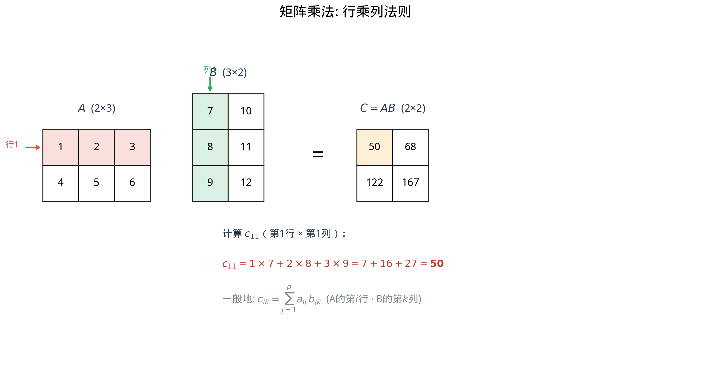

# §1 矩阵运算（Matrix Operations）[Bridge]

**前置知识**：[Ch01 向量空间](../ch01-vector-spaces/README.md)（向量、$\mathbb{R}^n$、线性组合）、[Part 3 代数](../../part-03-algebra/README.md)（代数运算）

**全景图**：矩阵是将数排列成矩形阵列的数学对象。它最初看起来只是"数表"，但其真正的力量在于：矩阵是**线性变换的代数表示**——每个矩阵对应一个将向量映射为向量的线性函数。本节介绍矩阵的基本运算（加法、标量乘法、乘法），着重讨论矩阵乘法的定义和性质（特别是它**不满足交换律**）。这些运算是 Ch03（线性方程组）和 Ch04（行列式）的计算基础。

**预估学习时间**：约 4–5 小时

---

## 动机

考虑一个线性方程组：

$$\begin{cases} 2x + 3y = 5 \\ 4x - y = 1 \end{cases}$$

如果我们把系数、未知数和常数分别"打包"：

$$\underbrace{\begin{pmatrix} 2 & 3 \\ 4 & -1 \end{pmatrix}}_{A} \underbrace{\begin{pmatrix} x \\ y \end{pmatrix}}_{\mathbf{x}} = \underbrace{\begin{pmatrix} 5 \\ 1 \end{pmatrix}}_{\mathbf{b}}$$

整个方程组就浓缩为一个简洁的矩阵方程 $A\mathbf{x} = \mathbf{b}$。这就是矩阵的魅力——用一个符号封装复杂的结构。

但矩阵的作用远不止记号的简化。矩阵 $A$ 定义了一个**函数**：它将输入向量 $\mathbf{x}$ 映射为输出向量 $A\mathbf{x}$。理解矩阵运算，就是理解这些线性函数如何组合、如何变换。

---

## 1. 矩阵的定义（Matrix Definition）

> **定义 1**（矩阵）
>
> 一个 $m \times n$（读作"$m$ 乘 $n$"）**矩阵**（matrix）是一个由实数排列成 $m$ 行 $n$ 列的矩形阵列：
>
> $$A = \begin{pmatrix} a_{11} & a_{12} & \cdots & a_{1n} \\ a_{21} & a_{22} & \cdots & a_{2n} \\ \vdots & \vdots & \ddots & \vdots \\ a_{m1} & a_{m2} & \cdots & a_{mn} \end{pmatrix}$$
>
> 简记为 $A = (a_{ij})_{m \times n}$ 或 $A = (a_{ij})$。$a_{ij}$ 是第 $i$ 行第 $j$ 列的元素（entry）。

**术语**：

- **行**（row）：水平方向。$A$ 有 $m$ 行。
- **列**（column）：垂直方向。$A$ 有 $n$ 列。
- **方阵**（square matrix）：$m = n$ 的矩阵。
- 所有 $m \times n$ 实矩阵的集合记为 $M_{m \times n}(\mathbb{R})$，简写为 $\mathbb{R}^{m \times n}$。

**向量与矩阵的关系**：$\mathbb{R}^n$ 中的列向量是 $n \times 1$ 矩阵；行向量是 $1 \times n$ 矩阵。

### 1.1 矩阵相等

> **定义 2**（矩阵相等）
>
> 两个矩阵 $A = (a_{ij})$ 和 $B = (b_{ij})$ **相等**，当且仅当它们**大小相同**（同为 $m \times n$）且**对应元素全部相等**：
>
> $$A = B \iff a_{ij} = b_{ij}, \quad \forall i, j$$

---

## 2. 矩阵加法与标量乘法（Addition & Scalar Multiplication）

> **定义 3**（矩阵加法）
>
> 设 $A = (a_{ij})$ 和 $B = (b_{ij})$ 同为 $m \times n$ 矩阵。它们的**和**为：
>
> $$A + B = (a_{ij} + b_{ij})_{m \times n}$$

即逐元素相加。只有**大小相同**的矩阵才能相加。

> **定义 4**（标量乘法）
>
> 设 $c \in \mathbb{R}$，$A = (a_{ij})$。则：
>
> $$cA = (c \cdot a_{ij})_{m \times n}$$

**例子**：

$$\begin{pmatrix} 1 & 2 \\ 3 & 4 \end{pmatrix} + \begin{pmatrix} 5 & 6 \\ 7 & 8 \end{pmatrix} = \begin{pmatrix} 6 & 8 \\ 10 & 12 \end{pmatrix}, \qquad 3\begin{pmatrix} 1 & 2 \\ 3 & 4 \end{pmatrix} = \begin{pmatrix} 3 & 6 \\ 9 & 12 \end{pmatrix}$$

在这些运算下，$M_{m \times n}(\mathbb{R})$ 构成一个向量空间（维数为 $mn$），零元素是**零矩阵** $O$（所有元素为 $0$）。

---

## 3. 矩阵乘法（Matrix Multiplication）

矩阵乘法是线性代数最核心的运算——它的定义看起来不那么直观，但背后有深刻的理由。

> **定义 5**（矩阵乘法）
>
> 设 $A = (a_{ij})$ 是 $m \times p$ 矩阵，$B = (b_{jk})$ 是 $p \times n$ 矩阵。它们的**乘积** $C = AB$ 是 $m \times n$ 矩阵，第 $i$ 行第 $k$ 列的元素为：
>
> $$c_{ik} = \sum_{j=1}^{p} a_{ij} b_{jk} = a_{i1}b_{1k} + a_{i2}b_{2k} + \cdots + a_{ip}b_{pk}$$

**关键要求**：$A$ 的**列数**必须等于 $B$ 的**行数**（都是 $p$）。结果的大小：$m \times n$。

**记忆法**：$C$ 的第 $(i, k)$ 元素 = $A$ 的第 $i$ **行**与 $B$ 的第 $k$ **列**的**点积**。

$$\underbrace{(m \times p)}_{A} \cdot \underbrace{(p \times n)}_{B} = \underbrace{(m \times n)}_{C}$$

**口诀**："行乘列，内积消"——$A$ 的行和 $B$ 的列做内积，中间的 $p$ "消去"。

### 3.1 详细计算示例

$$A = \begin{pmatrix} 1 & 2 & 3 \\ 4 & 5 & 6 \end{pmatrix}_{2 \times 3}, \qquad B = \begin{pmatrix} 7 & 10 \\ 8 & 11 \\ 9 & 12 \end{pmatrix}_{3 \times 2}$$

$AB$ 是 $2 \times 2$ 矩阵：

$$c_{11} = 1 \cdot 7 + 2 \cdot 8 + 3 \cdot 9 = 7 + 16 + 27 = 50$$
$$c_{12} = 1 \cdot 10 + 2 \cdot 11 + 3 \cdot 12 = 10 + 22 + 36 = 68$$
$$c_{21} = 4 \cdot 7 + 5 \cdot 8 + 6 \cdot 9 = 28 + 40 + 54 = 122$$
$$c_{22} = 4 \cdot 10 + 5 \cdot 11 + 6 \cdot 12 = 40 + 55 + 72 = 167$$

$$AB = \begin{pmatrix} 50 & 68 \\ 122 & 167 \end{pmatrix}$$

### 3.2 矩阵作用于向量

矩阵乘法的一个特殊情形：$m \times n$ 矩阵 $A$ 乘以 $n \times 1$ 列向量 $\mathbf{x}$：

$$A\mathbf{x} = \begin{pmatrix} a_{11} & \cdots & a_{1n} \\ \vdots & & \vdots \\ a_{m1} & \cdots & a_{mn} \end{pmatrix} \begin{pmatrix} x_1 \\ \vdots \\ x_n \end{pmatrix} = \begin{pmatrix} a_{11}x_1 + \cdots + a_{1n}x_n \\ \vdots \\ a_{m1}x_1 + \cdots + a_{mn}x_n \end{pmatrix}$$

**列的观点**：设 $A$ 的列向量为 $\mathbf{a}_1, \ldots, \mathbf{a}_n$。则：

$$A\mathbf{x} = x_1 \mathbf{a}_1 + x_2 \mathbf{a}_2 + \cdots + x_n \mathbf{a}_n$$

$A\mathbf{x}$ 是 $A$ 的**列向量的线性组合**！这个观点极其重要——它将矩阵乘法与 Ch01 的线性组合联系起来。

---

## 4. 矩阵乘法的性质（Properties of Matrix Multiplication）

### 4.1 满足的性质

设 $A, B, C$ 为大小适当的矩阵，$c \in \mathbb{R}$：

| 性质 | 公式 |
|------|------|
| 结合律 | $(AB)C = A(BC)$ |
| 左分配律 | $A(B + C) = AB + AC$ |
| 右分配律 | $(A + B)C = AC + BC$ |
| 标量兼容 | $c(AB) = (cA)B = A(cB)$ |

### 4.2 不满足交换律！

> **警告**：矩阵乘法一般**不**满足交换律：$AB \neq BA$。

**原因 1**（大小不匹配）：$A$ 是 $2 \times 3$，$B$ 是 $3 \times 4$。$AB$ 是 $2 \times 4$ 矩阵，但 $BA$ 无法计算（$4 \neq 2$）。

**原因 2**（即使都是方阵）：

$$A = \begin{pmatrix} 1 & 0 \\ 0 & 0 \end{pmatrix}, \quad B = \begin{pmatrix} 0 & 1 \\ 0 & 0 \end{pmatrix}$$

$$AB = \begin{pmatrix} 0 & 1 \\ 0 & 0 \end{pmatrix}, \qquad BA = \begin{pmatrix} 0 & 0 \\ 0 & 0 \end{pmatrix}$$

$AB \neq BA$！这是线性代数与普通算术的一个重大区别。

### 4.3 零因子现象

在实数中，$ab = 0$ 蕴含 $a = 0$ 或 $b = 0$。但矩阵中**不成立**：

$$\begin{pmatrix} 1 & 0 \\ 0 & 0 \end{pmatrix} \begin{pmatrix} 0 & 0 \\ 1 & 0 \end{pmatrix} = \begin{pmatrix} 0 & 0 \\ 0 & 0 \end{pmatrix}$$

$AB = O$，但 $A \neq O$ 且 $B \neq O$。这种现象称为**零因子**（zero divisors）。

### 4.4 消去律不成立

$AB = AC$ **不能**推出 $B = C$（即使 $A \neq O$）。这也是因为零因子的存在：$A(B - C) = O$ 不蕴含 $B - C = O$。

---

## 5. 矩阵作为线性变换（Matrix as Linear Transformation）

> **核心观点**
>
> 每个 $m \times n$ 矩阵 $A$ 定义了一个**线性变换**（linear transformation）：
>
> $$T_A: \mathbb{R}^n \to \mathbb{R}^m, \quad T_A(\mathbf{x}) = A\mathbf{x}$$

**"线性"的含义**——$T_A$ 满足：
- $T_A(\mathbf{x} + \mathbf{y}) = T_A(\mathbf{x}) + T_A(\mathbf{y})$（保持加法）
- $T_A(c\mathbf{x}) = cT_A(\mathbf{x})$（保持标量乘法）

**证明**：$A(\mathbf{x} + \mathbf{y}) = A\mathbf{x} + A\mathbf{y}$（分配律）；$A(c\mathbf{x}) = c(A\mathbf{x})$（标量兼容）。

**矩阵乘法 = 变换的复合**：如果 $A$ 是 $m \times p$ 矩阵，$B$ 是 $p \times n$ 矩阵，则：

$$T_{AB}(\mathbf{x}) = (AB)\mathbf{x} = A(B\mathbf{x}) = T_A(T_B(\mathbf{x}))$$

矩阵 $AB$ 对应先做 $T_B$、再做 $T_A$ 的复合变换。这就是矩阵乘法定义背后的深层原因——它是**函数复合的代数化**。

**几何例子**（$\mathbb{R}^2$ 中的线性变换）：

| 矩阵 | 变换 |
|------|------|
| $\begin{pmatrix} \cos\theta & -\sin\theta \\ \sin\theta & \cos\theta \end{pmatrix}$ | 逆时针旋转 $\theta$ |
| $\begin{pmatrix} k & 0 \\ 0 & k \end{pmatrix}$ | 均匀缩放 $k$ 倍 |
| $\begin{pmatrix} 1 & 0 \\ 0 & -1 \end{pmatrix}$ | 关于 $x$ 轴的反射 |
| $\begin{pmatrix} 1 & c \\ 0 & 1 \end{pmatrix}$ | 水平剪切（shear） |

---

## 例题

### 例题 1：矩阵乘法

> **题目**：计算 $AB$ 和 $BA$（如果可能）：
>
> $$A = \begin{pmatrix} 1 & 2 \\ 3 & 4 \end{pmatrix}, \qquad B = \begin{pmatrix} 0 & 1 \\ 1 & 0 \end{pmatrix}$$

**解答**：

$A, B$ 都是 $2 \times 2$，所以 $AB$ 和 $BA$ 都有定义。

$$AB = \begin{pmatrix} 1 \cdot 0 + 2 \cdot 1 & 1 \cdot 1 + 2 \cdot 0 \\ 3 \cdot 0 + 4 \cdot 1 & 3 \cdot 1 + 4 \cdot 0 \end{pmatrix} = \begin{pmatrix} 2 & 1 \\ 4 & 3 \end{pmatrix}$$

$$BA = \begin{pmatrix} 0 \cdot 1 + 1 \cdot 3 & 0 \cdot 2 + 1 \cdot 4 \\ 1 \cdot 1 + 0 \cdot 3 & 1 \cdot 2 + 0 \cdot 4 \end{pmatrix} = \begin{pmatrix} 3 & 4 \\ 1 & 2 \end{pmatrix}$$

$AB \neq BA$——矩阵乘法不满足交换律。

**几何解释**：$B = \begin{pmatrix} 0 & 1 \\ 1 & 0 \end{pmatrix}$ 是关于直线 $y = x$ 的反射。$AB$ 表示"先反射再做 $A$ 变换"，$BA$ 表示"先做 $A$ 变换再反射"——两者当然不同。$\blacksquare$

### 例题 2：矩阵作用于向量

> **题目**：设 $A = \begin{pmatrix} 1 & -1 \\ 2 & 3 \end{pmatrix}$，$\mathbf{x} = \begin{pmatrix} 4 \\ 1 \end{pmatrix}$。计算 $A\mathbf{x}$ 并解释其列向量含义。

**解答**：

$$A\mathbf{x} = \begin{pmatrix} 1 \cdot 4 + (-1) \cdot 1 \\ 2 \cdot 4 + 3 \cdot 1 \end{pmatrix} = \begin{pmatrix} 3 \\ 11 \end{pmatrix}$$

**列的观点**：$A$ 的列为 $\mathbf{a}_1 = \begin{pmatrix} 1 \\ 2 \end{pmatrix}$，$\mathbf{a}_2 = \begin{pmatrix} -1 \\ 3 \end{pmatrix}$。

$$A\mathbf{x} = 4\mathbf{a}_1 + 1\mathbf{a}_2 = 4\begin{pmatrix} 1 \\ 2 \end{pmatrix} + 1\begin{pmatrix} -1 \\ 3 \end{pmatrix} = \begin{pmatrix} 4 \\ 8 \end{pmatrix} + \begin{pmatrix} -1 \\ 3 \end{pmatrix} = \begin{pmatrix} 3 \\ 11 \end{pmatrix}$$

$A\mathbf{x}$ 是 $A$ 的列向量以 $\mathbf{x}$ 的分量为系数的线性组合。$\blacksquare$

### 例题 3：验证结合律

> **题目**：设 $A = \begin{pmatrix} 1 & 0 \\ 2 & 1 \end{pmatrix}$，$B = \begin{pmatrix} 3 & 1 \\ 0 & 2 \end{pmatrix}$，$C = \begin{pmatrix} 1 \\ 1 \end{pmatrix}$。验证 $(AB)C = A(BC)$。

**解答**：

$$AB = \begin{pmatrix} 3 & 1 \\ 6 & 4 \end{pmatrix}$$

$$(AB)C = \begin{pmatrix} 3 & 1 \\ 6 & 4 \end{pmatrix}\begin{pmatrix} 1 \\ 1 \end{pmatrix} = \begin{pmatrix} 4 \\ 10 \end{pmatrix}$$

$$BC = \begin{pmatrix} 3 & 1 \\ 0 & 2 \end{pmatrix}\begin{pmatrix} 1 \\ 1 \end{pmatrix} = \begin{pmatrix} 4 \\ 2 \end{pmatrix}$$

$$A(BC) = \begin{pmatrix} 1 & 0 \\ 2 & 1 \end{pmatrix}\begin{pmatrix} 4 \\ 2 \end{pmatrix} = \begin{pmatrix} 4 \\ 10 \end{pmatrix}$$

$(AB)C = A(BC) = \begin{pmatrix} 4 \\ 10 \end{pmatrix}$。✓ $\blacksquare$

---

## 要点回顾

| 概念 | 要点 |
|------|------|
| $m \times n$ 矩阵 | $m$ 行 $n$ 列的实数阵列 |
| 矩阵加法 | 大小相同，逐元素相加 |
| 标量乘法 | 每个元素乘标量 |
| 矩阵乘法 | $A_{m \times p} \cdot B_{p \times n} = C_{m \times n}$，$c_{ik} = \sum_j a_{ij}b_{jk}$ |
| 不满足交换律 | $AB \neq BA$（一般地） |
| 零因子 | $AB = O$ 不蕴含 $A = O$ 或 $B = O$ |
| 列的观点 | $A\mathbf{x} = x_1\mathbf{a}_1 + \cdots + x_n\mathbf{a}_n$ |
| 矩阵 = 线性变换 | $T_A(\mathbf{x}) = A\mathbf{x}$，乘法 = 变换复合 |

---

## 进度检查点

完成本节后，你应该能够：

- [ ] 判断两个矩阵是否能相乘，并给出乘积的大小
- [ ] 手动计算 $2 \times 2$ 和 $3 \times 3$ 矩阵的乘积
- [ ] 举出 $AB \neq BA$ 的具体例子
- [ ] 把 $A\mathbf{x}$ 解读为列向量的线性组合
- [ ] 识别旋转、反射、缩放对应的 $2 \times 2$ 矩阵

---

## 自测题

**1.** 设 $A$ 是 $3 \times 4$ 矩阵，$B$ 是 $4 \times 2$ 矩阵。$AB$ 的大小是什么？$BA$ 能否计算？

答案

$AB$ 是 $3 \times 2$ 矩阵。$BA$ 不能计算——$B$ 的列数 $2$ 不等于 $A$ 的行数 $3$。

**2.** 计算 $\begin{pmatrix} 2 & 1 \\ 0 & 3 \end{pmatrix} \begin{pmatrix} 1 & 0 \\ -1 & 2 \end{pmatrix}$。

答案

$$\begin{pmatrix} 2 \cdot 1 + 1 \cdot (-1) & 2 \cdot 0 + 1 \cdot 2 \\ 0 \cdot 1 + 3 \cdot (-1) & 0 \cdot 0 + 3 \cdot 2 \end{pmatrix} = \begin{pmatrix} 1 & 2 \\ -3 & 6 \end{pmatrix}$$

**3.** 哪个 $2 \times 2$ 矩阵表示将 $\mathbb{R}^2$ 中的每个点关于原点做 $180°$ 旋转？

答案

$180°$ 旋转对应 $\theta = \pi$：

$$\begin{pmatrix} \cos\pi & -\sin\pi \\ \sin\pi & \cos\pi \end{pmatrix} = \begin{pmatrix} -1 & 0 \\ 0 & -1 \end{pmatrix} = -I$$

即 $T(\mathbf{x}) = -\mathbf{x}$。

---

## 习题引用

本节练习见 [exercises/exercises.md](exercises/exercises.md) 第 §1 部分（第 1–10 题）。
