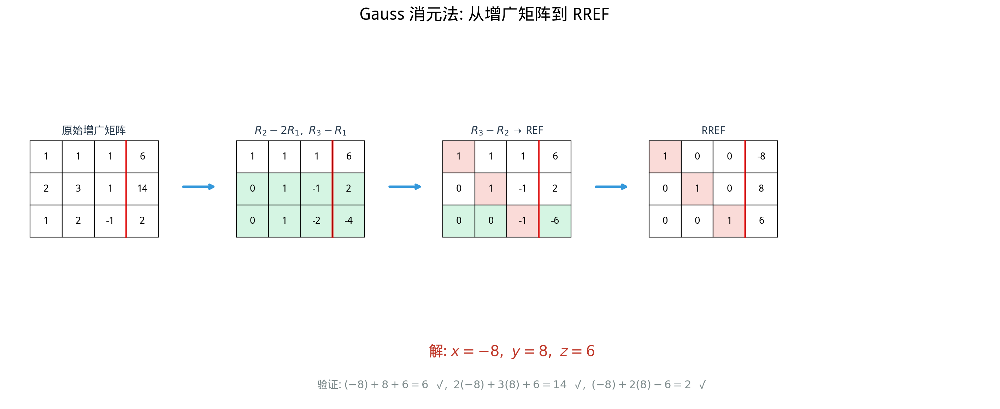

# §1 Gauss 消元法（Gaussian Elimination）[Bridge]

**前置知识**：[Ch01 向量空间](../ch01-vector-spaces/README.md)（向量、线性组合）、[Ch02 矩阵](../ch02-matrices/README.md)（矩阵定义、矩阵方程 $A\mathbf{x} = \mathbf{b}$）

**全景图**：Gauss 消元法是线性代数最基本的算法——它系统地将一个复杂的线性方程组化简为一个"几乎一目了然"的等价方程组。这个过程通过**行变换**操纵矩阵的行，最终达到**行阶梯形**或**简化行阶梯形**。从阶梯形可以直接读出方程组的解：有唯一解、无解还是无穷多解。Gauss 消元法是计算矩阵秩（§2）和行列式（Ch04）的工具，也是数值线性代数中最常用的算法。

**预估学习时间**：约 5–6 小时

---

## 动机

你从中学就知道怎么解二元一次方程组——用"消元法"或"代入法"。例如：

$$\begin{cases} x + 2y = 5 \\ 3x - y = 1 \end{cases}$$

第一个方程乘 $3$ 减去第二个方程，消去 $x$……但如果方程有 $10$ 个、$100$ 个、$10000$ 个未知数呢？

Gauss 消元法把消元过程**系统化**和**矩阵化**——用矩阵的行变换代替方程的操作，可以机械地处理任何规模的线性方程组。它以德国数学家 C.F. Gauss（1777–1855）命名，但实际上类似的方法在中国古代数学经典《九章算术》中就有记载（"方程术"）。

---

## 1. 线性方程组与增广矩阵（Linear System & Augmented Matrix）

### 1.1 一般形式

$m$ 个方程、$n$ 个未知数的线性方程组：

$$\begin{cases} a_{11}x_1 + a_{12}x_2 + \cdots + a_{1n}x_n = b_1 \\ a_{21}x_1 + a_{22}x_2 + \cdots + a_{2n}x_n = b_2 \\ \quad \vdots \\ a_{m1}x_1 + a_{m2}x_2 + \cdots + a_{mn}x_n = b_m \end{cases}$$

矩阵形式：$A\mathbf{x} = \mathbf{b}$，其中 $A = (a_{ij})_{m \times n}$，$\mathbf{x} = (x_1, \ldots, x_n)^T$，$\mathbf{b} = (b_1, \ldots, b_m)^T$。

### 1.2 增广矩阵

> **定义 1**（增广矩阵）
>
> 方程组 $A\mathbf{x} = \mathbf{b}$ 的**增广矩阵**（augmented matrix）是将 $A$ 和 $\mathbf{b}$ 并排写成的矩阵：
>
> $$(A \mid \mathbf{b}) = \left(\begin{array}{cccc|c} a_{11} & a_{12} & \cdots & a_{1n} & b_1 \\ a_{21} & a_{22} & \cdots & a_{2n} & b_2 \\ \vdots & \vdots & & \vdots & \vdots \\ a_{m1} & a_{m2} & \cdots & a_{mn} & b_m \end{array}\right)$$

增广矩阵包含了方程组的所有信息——系数和常数项。

---

## 2. 初等行变换（Elementary Row Operations）

> **定义 2**（三种初等行变换）
>
> 1. **交换**（Swap）：交换第 $i$ 行和第 $j$ 行。记作 $R_i \leftrightarrow R_j$。
> 2. **倍乘**（Scale）：将第 $i$ 行乘以非零常数 $c$。记作 $R_i \gets cR_i$（$c \neq 0$）。
> 3. **倍加**（Add）：将第 $j$ 行的 $c$ 倍加到第 $i$ 行。记作 $R_i \gets R_i + cR_j$。

**关键性质**：每种行变换都是**可逆的**（可以"撤销"），因此行变换不改变方程组的解集——变换前后的方程组**等价**。

---

## 3. 行阶梯形（Row Echelon Form, REF）

> **定义 3**（行阶梯形）
>
> 矩阵处于**行阶梯形**（REF），如果满足：
> 1. 所有全零行在底部。
> 2. 每个非零行的**首非零元素**（称为**主元**，pivot）严格在上一行主元的右边。

$$\text{REF 的形状: } \begin{pmatrix} \boxed{*} & * & * & * \\ 0 & \boxed{*} & * & * \\ 0 & 0 & 0 & \boxed{*} \\ 0 & 0 & 0 & 0 \end{pmatrix}$$

（方框中的 $*$ 是主元，每个主元严格在前一个的右下方。）

### 3.1 简化行阶梯形（Reduced Row Echelon Form, RREF）

> **定义 4**（简化行阶梯形）
>
> 矩阵处于**简化行阶梯形**（RREF），如果满足 REF 的条件，且额外满足：
> 3. 每个主元等于 $1$。
> 4. 主元是其所在列的**唯一非零元素**。

$$\text{RREF 的形状: } \begin{pmatrix} \boxed{1} & 0 & * & 0 \\ 0 & \boxed{1} & * & 0 \\ 0 & 0 & 0 & \boxed{1} \\ 0 & 0 & 0 & 0 \end{pmatrix}$$

RREF 是唯一的——每个矩阵的 RREF 只有一个。REF 则不唯一（主元的值可能不同）。

---

## 4. Gauss 消元算法（Gaussian Elimination Algorithm）

### 4.1 前向消元（Forward Elimination）→ REF

**算法步骤**：

1. 从最左边的列开始，找到一个非零元素作为**主元**（如果当前列全零，跳到下一列）。
2. 如果主元不在当前行，用行交换把它换上来。
3. 用"倍加"消去主元下方的所有元素。
4. 移到下一行和下一列，重复步骤 1–3。

### 4.2 回代（Back Substitution）或继续化简到 RREF

从 REF 出发，可以用**回代**（从最后一个主元开始，逐步求解每个变量）求解。或者继续用行变换将矩阵化为 RREF——此时解可以直接读出。

化为 RREF 的额外步骤（**Gauss–Jordan 消元**）：

5. 将每个主元所在行除以主元（使主元变为 $1$）。
6. 用"倍加"消去每个主元**上方**的所有元素。

---

## 5. 完整实例（Worked Examples）

### 5.1 唯一解的情形

$$\begin{cases} x + 2y + z = 9 \\ 2x - y + 3z = 8 \\ 3x + y - z = 3 \end{cases}$$

增广矩阵：

$$\left(\begin{array}{ccc|c} 1 & 2 & 1 & 9 \\ 2 & -1 & 3 & 8 \\ 3 & 1 & -1 & 3 \end{array}\right)$$

**步骤 1**：$R_2 \gets R_2 - 2R_1$，$R_3 \gets R_3 - 3R_1$：

$$\left(\begin{array}{ccc|c} 1 & 2 & 1 & 9 \\ 0 & -5 & 1 & -10 \\ 0 & -5 & -4 & -24 \end{array}\right)$$

**步骤 2**：$R_3 \gets R_3 - R_2$：

$$\left(\begin{array}{ccc|c} 1 & 2 & 1 & 9 \\ 0 & -5 & 1 & -10 \\ 0 & 0 & -5 & -14 \end{array}\right)$$

这是 REF。三个主元在三列中——唯一解。

**回代**：

第三行：$-5z = -14$，$z = 14/5$。

第二行：$-5y + z = -10$，$-5y = -10 - 14/5 = -64/5$，$y = 64/25$。

实际上，让我重新计算。$R_3 \gets R_3 - R_2$：

$$0 - 0 = 0, \quad -5 - (-5) = 0, \quad -4 - 1 = -5, \quad -24 - (-10) = -14$$

第三行：$-5z = -14$，$z = \frac{14}{5}$。

第二行：$-5y + \frac{14}{5} = -10$，$-5y = -10 - \frac{14}{5} = -\frac{64}{5}$，$y = \frac{64}{25}$。

第一行：$x + 2 \cdot \frac{64}{25} + \frac{14}{5} = 9$，$x = 9 - \frac{128}{25} - \frac{70}{25} = \frac{225 - 128 - 70}{25} = \frac{27}{25}$。

为了使例子更干净，让我换一个方程组。

---

**换一个更干净的例子**：

$$\begin{cases} x + y + z = 6 \\ 2x + 3y + z = 14 \\ x + 2y - z = 2 \end{cases}$$

增广矩阵：

$$\left(\begin{array}{ccc|c} 1 & 1 & 1 & 6 \\ 2 & 3 & 1 & 14 \\ 1 & 2 & -1 & 2 \end{array}\right)$$

**步骤 1**：$R_2 \gets R_2 - 2R_1$，$R_3 \gets R_3 - R_1$：

$$\left(\begin{array}{ccc|c} 1 & 1 & 1 & 6 \\ 0 & 1 & -1 & 2 \\ 0 & 1 & -2 & -4 \end{array}\right)$$

**步骤 2**：$R_3 \gets R_3 - R_2$：

$$\left(\begin{array}{ccc|c} 1 & 1 & 1 & 6 \\ 0 & 1 & -1 & 2 \\ 0 & 0 & -1 & -6 \end{array}\right)$$

REF 完成。三个主元 → **唯一解**。

**回代**：

- $R_3$：$-z = -6$，$z = 6$。
- $R_2$：$y - 6 = 2$，$y = 8$。但让我验证：$y - z = 2$，$y = 2 + z = 2 + 6 = 8$。
- $R_1$：$x + 8 + 6 = 6$，$x = -8$。

验证：$-8 + 8 + 6 = 6$ ✓，$2(-8) + 3(8) + 6 = -16 + 24 + 6 = 14$ ✓，$-8 + 16 - 6 = 2$ ✓。

$$\boxed{x = -8, \quad y = 8, \quad z = 6}$$

### 5.2 无解的情形

$$\begin{cases} x + y = 3 \\ 2x + 2y = 8 \end{cases}$$

增广矩阵：

$$\left(\begin{array}{cc|c} 1 & 1 & 3 \\ 2 & 2 & 8 \end{array}\right)$$

$R_2 \gets R_2 - 2R_1$：

$$\left(\begin{array}{cc|c} 1 & 1 & 3 \\ 0 & 0 & 2 \end{array}\right)$$

第二行表示 $0 = 2$——**矛盾**！方程组**无解**（inconsistent）。

几何意义：两个方程表示平面中的两条平行线 $x + y = 3$ 和 $x + y = 4$（$2x + 2y = 8$ 即 $x + y = 4$），它们不相交。

### 5.3 无穷多解的情形

$$\begin{cases} x + y - z = 2 \\ 2x + y + z = 5 \\ x + 2y - 4z = 1 \end{cases}$$

增广矩阵：

$$\left(\begin{array}{ccc|c} 1 & 1 & -1 & 2 \\ 2 & 1 & 1 & 5 \\ 1 & 2 & -4 & 1 \end{array}\right)$$

$R_2 \gets R_2 - 2R_1$，$R_3 \gets R_3 - R_1$：

$$\left(\begin{array}{ccc|c} 1 & 1 & -1 & 2 \\ 0 & -1 & 3 & 1 \\ 0 & 1 & -3 & -1 \end{array}\right)$$

$R_3 \gets R_3 + R_2$：

$$\left(\begin{array}{ccc|c} 1 & 1 & -1 & 2 \\ 0 & -1 & 3 & 1 \\ 0 & 0 & 0 & 0 \end{array}\right)$$

最后一行全零——消去了一个方程。主元只有两个（$x$ 和 $y$ 列），$z$ 是**自由变量**。

$R_2 \gets -R_2$：

$$\left(\begin{array}{ccc|c} 1 & 1 & -1 & 2 \\ 0 & 1 & -3 & -1 \\ 0 & 0 & 0 & 0 \end{array}\right)$$

$R_1 \gets R_1 - R_2$：

$$\left(\begin{array}{ccc|c} 1 & 0 & 2 & 3 \\ 0 & 1 & -3 & -1 \\ 0 & 0 & 0 & 0 \end{array}\right)$$

这是 RREF。读出解：

$$x = 3 - 2t, \quad y = -1 + 3t, \quad z = t \qquad (t \in \mathbb{R})$$

**无穷多解**，构成一条直线（参数 $t$）。

---

## 6. 三种情形的判定（Summary of Cases）

从 REF 的增广矩阵 $(A \mid \mathbf{b})$ 可以读出：

| 情形 | REF 特征 | 解 |
|------|----------|-----|
| **唯一解** | 每个变量对应一个主元（主元个数 = 未知数个数），且无矛盾行 | 回代求出唯一值 |
| **无解** | 存在矛盾行（形如 $0 \; 0 \; \cdots \; 0 \mid c$，$c \neq 0$） | 不相容（inconsistent） |
| **无穷多解** | 无矛盾行，但主元个数 < 未知数个数（有自由变量） | 用自由变量参数化 |

---

## 例题

### 例题 1：完整的 Gauss 消元

> **题目**：解线性方程组：
>
> $$\begin{cases} 2x + 4y - 2z = 2 \\ x + 2y + z = 4 \\ 3x + 6y + 2z = 10 \end{cases}$$

**解答**：

增广矩阵（先交换 $R_1$ 和 $R_2$ 以获得更简单的主元）：

$$\left(\begin{array}{ccc|c} 1 & 2 & 1 & 4 \\ 2 & 4 & -2 & 2 \\ 3 & 6 & 2 & 10 \end{array}\right)$$

$R_2 \gets R_2 - 2R_1$，$R_3 \gets R_3 - 3R_1$：

$$\left(\begin{array}{ccc|c} 1 & 2 & 1 & 4 \\ 0 & 0 & -4 & -6 \\ 0 & 0 & -1 & -2 \end{array}\right)$$

$R_3 \gets R_3 - \frac{1}{4}R_2$：

$$\left(\begin{array}{ccc|c} 1 & 2 & 1 & 4 \\ 0 & 0 & -4 & -6 \\ 0 & 0 & 0 & -\frac{1}{2} \end{array}\right)$$

第三行：$0 = -1/2$——**矛盾**！方程组**无解**。$\blacksquare$

### 例题 2：化为 RREF

> **题目**：将矩阵化为 RREF：$\begin{pmatrix} 1 & 3 & 1 \\ 2 & 4 & 0 \\ 0 & 1 & 1 \end{pmatrix}$。

**解答**：

$R_2 \gets R_2 - 2R_1$：

$$\begin{pmatrix} 1 & 3 & 1 \\ 0 & -2 & -2 \\ 0 & 1 & 1 \end{pmatrix}$$

$R_2 \gets -\frac{1}{2}R_2$：

$$\begin{pmatrix} 1 & 3 & 1 \\ 0 & 1 & 1 \\ 0 & 1 & 1 \end{pmatrix}$$

$R_3 \gets R_3 - R_2$：

$$\begin{pmatrix} 1 & 3 & 1 \\ 0 & 1 & 1 \\ 0 & 0 & 0 \end{pmatrix}$$

REF 完成。继续化为 RREF：$R_1 \gets R_1 - 3R_2$：

$$\begin{pmatrix} 1 & 0 & -2 \\ 0 & 1 & 1 \\ 0 & 0 & 0 \end{pmatrix}$$

这就是 RREF。$\blacksquare$

---

## 要点回顾

| 概念 | 要点 |
|------|------|
| 增广矩阵 | $(A \mid \mathbf{b})$，包含系数和常数项 |
| 三种行变换 | 交换、倍乘（$c \neq 0$）、倍加 |
| REF | 主元逐行右移，全零行在底部 |
| RREF | REF + 主元为 $1$ + 主元是列中唯一非零元 |
| Gauss 消元 | 前向消元 → REF → 回代/化为 RREF |
| 唯一解 | 主元个数 = 未知数个数，无矛盾 |
| 无解 | 存在矛盾行 $0 = c$（$c \neq 0$） |
| 无穷多解 | 无矛盾，主元 < 未知数（有自由变量） |

---

## 进度检查点

完成本节后，你应该能够：

- [ ] 将线性方程组写成增广矩阵
- [ ] 正确执行三种初等行变换
- [ ] 将增广矩阵化为 REF 和 RREF
- [ ] 从 REF/RREF 读出方程组有唯一解、无解还是无穷多解
- [ ] 用回代或参数化写出方程组的解

---

## 自测题

**1.** 以下矩阵是否为 REF？是否为 RREF？$\begin{pmatrix} 1 & 0 & 3 \\ 0 & 1 & 2 \\ 0 & 0 & 0 \end{pmatrix}$

答案

是 REF（主元逐行右移，全零行在底部）。也是 RREF（主元为 $1$，且主元所在列的其他元素为 $0$）。

**2.** 方程组 $\begin{cases} x + y = 1 \\ 2x + 2y = 2 \end{cases}$ 有多少解？

答案

增广矩阵 $\begin{pmatrix} 1 & 1 & 1 \\ 2 & 2 & 2 \end{pmatrix}$。$R_2 \gets R_2 - 2R_1$：$\begin{pmatrix} 1 & 1 & 1 \\ 0 & 0 & 0 \end{pmatrix}$。

无矛盾行，主元只有 $1$ 个（$x$ 列），$y$ 是自由变量。

$x = 1 - t, y = t$（$t \in \mathbb{R}$）。**无穷多解**。

**3.** 如果 $3 \times 3$ 矩阵的 REF 有三个主元，方程组 $A\mathbf{x} = \mathbf{b}$ 有几个解？

答案

三个主元意味着每列都有主元（$3$ 个变量，$3$ 个主元），不存在自由变量。如果增广矩阵无矛盾行（三个主元在 $A$ 的列中意味着不可能出现矛盾行），则方程组有**唯一解**。

---

## 习题引用

本节练习见 [exercises/exercises.md](exercises/exercises.md) 第 §1 部分（第 1–10 题）。
