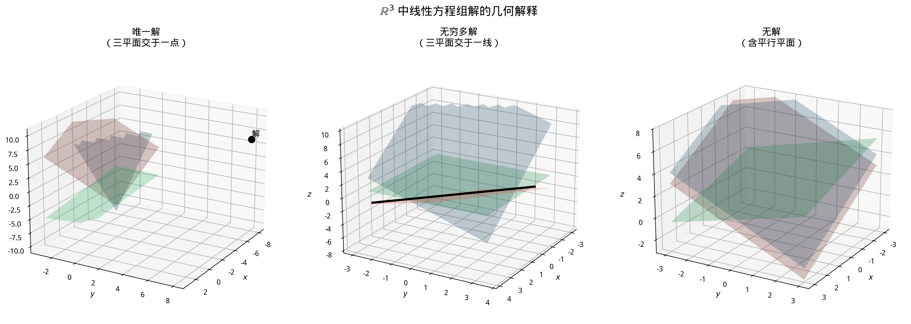

# §2 解的结构（Solution Structure）[Bridge]

**前置知识**：[§1 Gauss 消元法](01-gaussian-elimination.md)（增广矩阵、行变换、REF/RREF）、[Ch01 §1](../ch01-vector-spaces/01-vector-space-intuition.md)（子空间、子空间判定法）

**全景图**：上一节我们学会了用 Gauss 消元法求解线性方程组。现在我们要问：方程组的解有什么**结构**？齐次方程组 $A\mathbf{x} = \mathbf{0}$ 的解集构成一个**子空间**——这个事实将线性方程组与 Ch01 的向量空间理论联系起来。非齐次方程组的解则具有"特解 + 齐次解"的结构。**秩**（rank）是刻画矩阵"本质大小"的核心概念——秩-零度定理揭示了方程组解空间的维数与矩阵秩之间的精确关系。

**预估学习时间**：约 3–4 小时

---

## 动机

在 §1 中，我们看到线性方程组可能有唯一解、无解或无穷多解。自然的问题是：当有无穷多解时，这些解之间有什么关系？它们是"随意分布"的，还是有某种结构？

答案是：线性方程组的解集有着优美的**向量空间结构**。理解这个结构，就能把方程组的求解与 Ch01 的基和维数理论统一起来。

---

## 1. 齐次方程组（Homogeneous Systems）

> **定义 1**（齐次 vs 非齐次）
>
> - **齐次方程组**（homogeneous）：$A\mathbf{x} = \mathbf{0}$（右端为零向量）。
> - **非齐次方程组**（non-homogeneous）：$A\mathbf{x} = \mathbf{b}$（$\mathbf{b} \neq \mathbf{0}$）。

齐次方程组**总有解**——至少有**平凡解**（trivial solution）$\mathbf{x} = \mathbf{0}$。问题是：是否还有非平凡解？

### 1.1 解空间是子空间

> **定理 1**（齐次解空间是子空间）
>
> 设 $A$ 是 $m \times n$ 矩阵。齐次方程组 $A\mathbf{x} = \mathbf{0}$ 的解集：
>
> $$N(A) = \{\mathbf{x} \in \mathbb{R}^n : A\mathbf{x} = \mathbf{0}\}$$
>
> 是 $\mathbb{R}^n$ 的子空间。$N(A)$ 称为 $A$ 的**零空间**（null space）或**核**（kernel）。

**证明**（使用子空间判定法）：

- **零向量**：$A\mathbf{0} = \mathbf{0}$，所以 $\mathbf{0} \in N(A)$。✓
- **加法封闭**：若 $A\mathbf{x} = \mathbf{0}$ 且 $A\mathbf{y} = \mathbf{0}$，则 $A(\mathbf{x}+\mathbf{y}) = A\mathbf{x} + A\mathbf{y} = \mathbf{0} + \mathbf{0} = \mathbf{0}$。✓
- **标量乘法封闭**：若 $A\mathbf{x} = \mathbf{0}$，则 $A(c\mathbf{x}) = c(A\mathbf{x}) = c\mathbf{0} = \mathbf{0}$。✓ $\blacksquare$

**注意**：非齐次方程组的解集一般**不是**子空间（因为 $\mathbf{0}$ 通常不是解）。

---

## 2. 通解的结构（General Solution Structure）

> **定理 2**（通解 = 特解 + 齐次解）
>
> 设 $A\mathbf{x} = \mathbf{b}$ 有解。设 $\mathbf{x}_p$ 是一个**特解**（particular solution，满足 $A\mathbf{x}_p = \mathbf{b}$）。则方程组的**通解**（general solution）为：
>
> $$\mathbf{x} = \mathbf{x}_p + \mathbf{x}_h, \qquad \mathbf{x}_h \in N(A)$$
>
> 即所有解 = 一个特解 + 齐次方程 $A\mathbf{x} = \mathbf{0}$ 的任意解。

**证明**：

$(\Rightarrow)$：设 $A\mathbf{x} = \mathbf{b}$。则 $A(\mathbf{x} - \mathbf{x}_p) = A\mathbf{x} - A\mathbf{x}_p = \mathbf{b} - \mathbf{b} = \mathbf{0}$。所以 $\mathbf{x} - \mathbf{x}_p = \mathbf{x}_h \in N(A)$。

$(\Leftarrow)$：设 $\mathbf{x} = \mathbf{x}_p + \mathbf{x}_h$，$\mathbf{x}_h \in N(A)$。则 $A\mathbf{x} = A\mathbf{x}_p + A\mathbf{x}_h = \mathbf{b} + \mathbf{0} = \mathbf{b}$。$\blacksquare$

**直觉**：非齐次解集是齐次解空间的"平移"——不是子空间，而是一个**仿射子空间**（affine subspace）。

---

## 3. 矩阵的秩（Rank of a Matrix）

> **定义 2**（秩）
>
> 矩阵 $A$ 的**秩**（rank），记作 $\text{rank}(A)$ 或 $r(A)$，是 $A$ 的行阶梯形（REF）中**主元的个数**。
>
> 等价地，$\text{rank}(A)$ 等于 $A$ 的行空间的维数，也等于列空间的维数。

**计算方法**：对 $A$ 做 Gauss 消元，数主元的个数。

**例子**：

$$A = \begin{pmatrix} 1 & 2 & 3 \\ 2 & 4 & 6 \\ 1 & 3 & 5 \end{pmatrix} \xrightarrow{REF} \begin{pmatrix} 1 & 2 & 3 \\ 0 & 1 & 2 \\ 0 & 0 & 0 \end{pmatrix}$$

两个主元，所以 $\text{rank}(A) = 2$。

### 3.1 秩的性质

| 性质 | 说明 |
|------|------|
| $0 \leq \text{rank}(A) \leq \min(m, n)$ | 主元不超过行数和列数 |
| $\text{rank}(A) = \text{rank}(A^T)$ | 行秩 = 列秩 |
| $\text{rank}(A) = n \Rightarrow$ 列满秩 | 列线性无关 |
| $\text{rank}(A) = m \Rightarrow$ 行满秩 | 行线性无关 |

### 3.2 秩与方程组的关系

设 $A$ 是 $m \times n$ 矩阵，$r = \text{rank}(A)$，考虑 $A\mathbf{x} = \mathbf{b}$：

| 条件 | 含义 |
|------|------|
| $\text{rank}(A) = \text{rank}(A \mid \mathbf{b})$ | 方程组**有解**（相容） |
| $\text{rank}(A) < \text{rank}(A \mid \mathbf{b})$ | 方程组**无解**（不相容） |
| $\text{rank}(A) = n$（满秩） | 如果有解，则解**唯一** |
| $\text{rank}(A) < n$ | 如果有解，则有**无穷多解**（$n - r$ 个自由变量） |

---

## 4. 秩-零度定理（Rank-Nullity Theorem）

> **定义 3**（零度）
>
> $A$ 的**零度**（nullity）是零空间 $N(A)$ 的维数：$\text{nullity}(A) = \dim N(A)$。

> **定理 3**（秩-零度定理，Rank-Nullity Theorem）
>
> 设 $A$ 是 $m \times n$ 矩阵。则：
>
> $$\text{rank}(A) + \text{nullity}(A) = n$$
>
> 即**主元个数 + 自由变量个数 = 未知数总数**。

**证明思路**：RREF 中，每个主元对应一个**主变量**，每个没有主元的列对应一个**自由变量**。自由变量的个数就是齐次解空间的维数。主元个数 + 自由变量个数 = 列数 $n$。

**例子**：$A$ 是 $3 \times 5$ 矩阵，$\text{rank}(A) = 2$。则：

$$\text{nullity}(A) = 5 - 2 = 3$$

齐次方程 $A\mathbf{x} = \mathbf{0}$ 的解空间是 $\mathbb{R}^5$ 的一个 $3$ 维子空间。

---

## 5. 几何解释（Geometric Interpretation in $\mathbb{R}^3$）

在 $\mathbb{R}^3$ 中，一个线性方程 $ax + by + cz = d$ 表示一个**平面**。两个方程的组合表示两个平面的交集，三个方程表示三个平面的交集。

| 情形 | 几何 | 代数 |
|------|------|------|
| 三个平面交于一点 | 唯一交点 | $\text{rank} = 3$，唯一解 |
| 三个平面交于一条线 | 一条公共直线 | $\text{rank} = 2$，$1$ 个自由变量 |
| 三个平面交于一个平面 | 三个方程描述同一平面 | $\text{rank} = 1$，$2$ 个自由变量 |
| 两个平面平行 | 无交点 | 无解 |
| 三个平面形成"三棱柱" | 无公共交点 | 无解 |

---

## 例题

### 例题 1：求零空间的基

> **题目**：求 $A = \begin{pmatrix} 1 & 2 & 1 & 0 \\ 2 & 4 & 0 & 2 \\ 1 & 2 & -1 & 2 \end{pmatrix}$ 的零空间 $N(A)$ 的一组基和维数。

**解答**：

解齐次方程 $A\mathbf{x} = \mathbf{0}$。对 $A$ 做行变换：

$R_2 \gets R_2 - 2R_1$，$R_3 \gets R_3 - R_1$：

$$\begin{pmatrix} 1 & 2 & 1 & 0 \\ 0 & 0 & -2 & 2 \\ 0 & 0 & -2 & 2 \end{pmatrix}$$

$R_3 \gets R_3 - R_2$：

$$\begin{pmatrix} 1 & 2 & 1 & 0 \\ 0 & 0 & -2 & 2 \\ 0 & 0 & 0 & 0 \end{pmatrix}$$

$R_2 \gets -\frac{1}{2}R_2$：

$$\begin{pmatrix} 1 & 2 & 1 & 0 \\ 0 & 0 & 1 & -1 \\ 0 & 0 & 0 & 0 \end{pmatrix}$$

$R_1 \gets R_1 - R_2$：

$$\begin{pmatrix} 1 & 2 & 0 & 1 \\ 0 & 0 & 1 & -1 \\ 0 & 0 & 0 & 0 \end{pmatrix}$$

RREF。主元在第 $1, 3$ 列（$x_1, x_3$ 是主变量），$x_2, x_4$ 是自由变量。

$$x_1 = -2x_2 - x_4, \quad x_3 = x_4$$

令 $x_2 = s, x_4 = t$：

$$\mathbf{x} = s\begin{pmatrix} -2 \\ 1 \\ 0 \\ 0 \end{pmatrix} + t\begin{pmatrix} -1 \\ 0 \\ 1 \\ 1 \end{pmatrix}$$

$N(A)$ 的一组基为 $\left\{\begin{pmatrix} -2 \\ 1 \\ 0 \\ 0 \end{pmatrix}, \begin{pmatrix} -1 \\ 0 \\ 1 \\ 1 \end{pmatrix}\right\}$，$\dim N(A) = 2$。

验证秩-零度定理：$\text{rank}(A) = 2$（两个主元），$\text{nullity}(A) = 2$，$2 + 2 = 4 = n$。✓ $\blacksquare$

### 例题 2：通解结构

> **题目**：求方程组的通解：
>
> $$\begin{cases} x_1 + 2x_2 + x_3 = 4 \\ 2x_1 + 4x_2 + 3x_3 = 9 \end{cases}$$

**解答**：

增广矩阵：$\left(\begin{array}{ccc|c} 1 & 2 & 1 & 4 \\ 2 & 4 & 3 & 9 \end{array}\right)$。

$R_2 \gets R_2 - 2R_1$：

$$\left(\begin{array}{ccc|c} 1 & 2 & 1 & 4 \\ 0 & 0 & 1 & 1 \end{array}\right)$$

$R_1 \gets R_1 - R_2$：

$$\left(\begin{array}{ccc|c} 1 & 2 & 0 & 3 \\ 0 & 0 & 1 & 1 \end{array}\right)$$

主变量：$x_1, x_3$。自由变量：$x_2 = t$。

$$x_1 = 3 - 2t, \quad x_2 = t, \quad x_3 = 1$$

通解：

$$\mathbf{x} = \underbrace{\begin{pmatrix} 3 \\ 0 \\ 1 \end{pmatrix}}_{\text{特解 } \mathbf{x}_p} + t\underbrace{\begin{pmatrix} -2 \\ 1 \\ 0 \end{pmatrix}}_{\text{齐次解}}$$

齐次部分 $\begin{pmatrix} -2 \\ 1 \\ 0 \end{pmatrix}$ 是 $A\mathbf{x} = \mathbf{0}$ 的解（即 $N(A)$ 的基向量）。$\blacksquare$

### 例题 3：秩与解的判定

> **题目**：设 $A$ 是 $4 \times 6$ 矩阵，$\text{rank}(A) = 3$。
>
> (a) $A\mathbf{x} = \mathbf{0}$ 的解空间维数是多少？
>
> (b) 如果 $A\mathbf{x} = \mathbf{b}$ 有解，有多少个自由变量？

**解答**：

(a) 秩-零度定理：$\text{nullity}(A) = n - \text{rank}(A) = 6 - 3 = 3$。

(b) 自由变量个数 = $n - \text{rank}(A) = 6 - 3 = 3$ 个。$\blacksquare$

---

## 要点回顾

| 概念 | 要点 |
|------|------|
| 齐次方程 | $A\mathbf{x} = \mathbf{0}$，总有平凡解 |
| 零空间 $N(A)$ | 齐次解集，是 $\mathbb{R}^n$ 的子空间 |
| 通解结构 | $\mathbf{x} = \mathbf{x}_p + \mathbf{x}_h$（特解 + 齐次解） |
| 秩 $\text{rank}(A)$ | REF 中主元个数 |
| 零度 $\text{nullity}(A)$ | $N(A)$ 的维数 = 自由变量个数 |
| 秩-零度定理 | $\text{rank}(A) + \text{nullity}(A) = n$ |
| 解的存在 | $\text{rank}(A) = \text{rank}(A \mid \mathbf{b})$ |
| 解的唯一 | 有解且 $\text{rank}(A) = n$ |

---

## 进度检查点

完成本节后，你应该能够：

- [ ] 区分齐次与非齐次线性方程组
- [ ] 证明齐次解集是子空间
- [ ] 写出通解的"特解 + 齐次解"形式
- [ ] 计算矩阵的秩
- [ ] 用秩-零度定理确定解空间的维数
- [ ] 用几何语言描述 $\mathbb{R}^3$ 中方程组的解

---

## 自测题

**1.** 设 $A$ 是 $3 \times 3$ 矩阵，$\text{rank}(A) = 2$。$A\mathbf{x} = \mathbf{0}$ 的解空间维数是多少？

答案

$\text{nullity}(A) = 3 - 2 = 1$。解空间是 $\mathbb{R}^3$ 中过原点的一条直线（一维子空间）。

**2.** 非齐次方程组 $A\mathbf{x} = \mathbf{b}$（$\mathbf{b} \neq \mathbf{0}$）的解集是否为子空间？

答案

不是。若 $A\mathbf{x}_1 = \mathbf{b}$，则 $A(\mathbf{x}_1 + \mathbf{x}_1) = 2\mathbf{b} \neq \mathbf{b}$（一般地），所以加法不封闭。也可以注意到 $\mathbf{0}$ 通常不是解。

**3.** 矩阵 $A = \begin{pmatrix} 1 & 0 & 2 \\ 0 & 1 & -1 \\ 1 & 1 & 1 \end{pmatrix}$ 的秩是多少？

答案

$R_3 \gets R_3 - R_1$：$\begin{pmatrix} 1 & 0 & 2 \\ 0 & 1 & -1 \\ 0 & 1 & -1 \end{pmatrix}$。$R_3 \gets R_3 - R_2$：$\begin{pmatrix} 1 & 0 & 2 \\ 0 & 1 & -1 \\ 0 & 0 & 0 \end{pmatrix}$。

两个主元，$\text{rank}(A) = 2$。

---

## 习题引用

本节练习见 [exercises/exercises.md](exercises/exercises.md) 第 §2 部分（第 11–20 题）。
