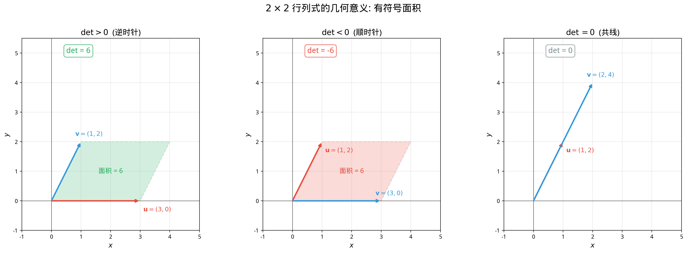
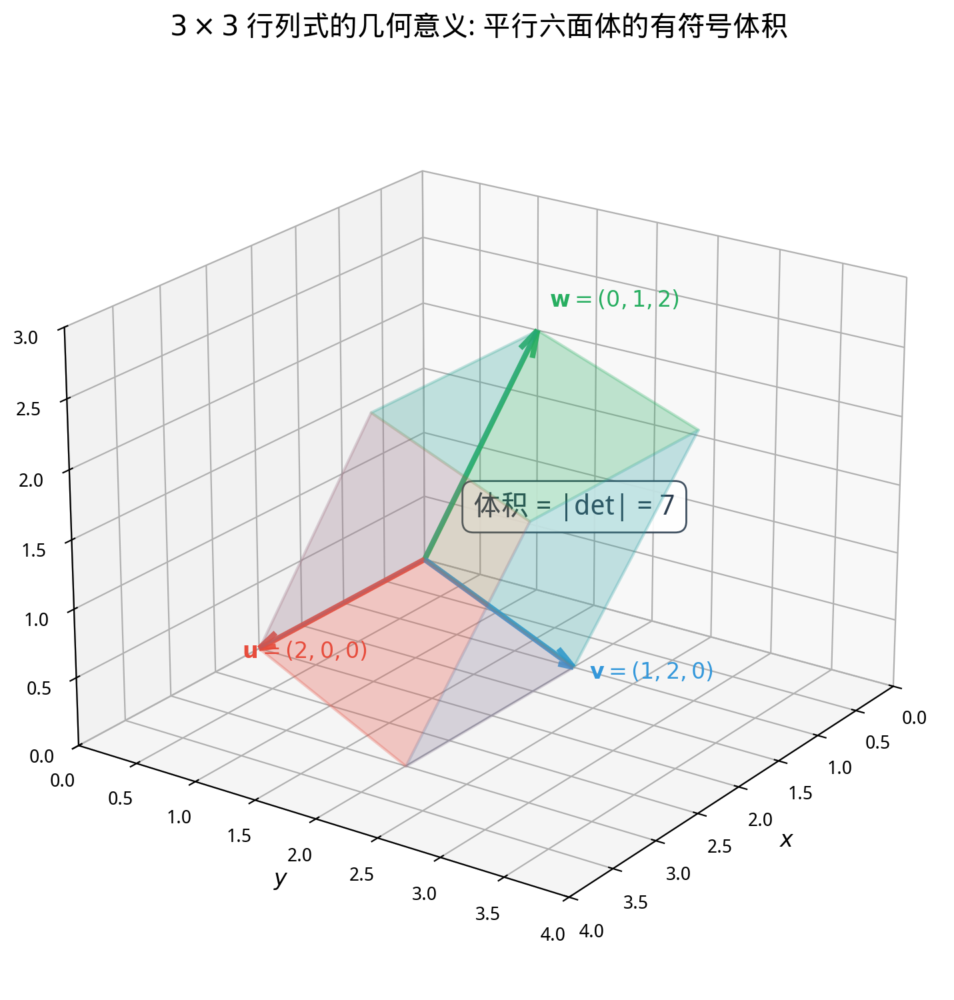

# §1 行列式（Determinants）[Bridge]

**前置知识**：[Ch02 矩阵](../ch02-matrices/README.md)（矩阵运算、转置）、[Ch03 线性方程组](../ch03-linear-systems/README.md)（行变换、秩）、[Part 5 第 5 章 向量](../../part-05-geometry/ch05-vectors/README.md)（叉积与面积，推荐但非必须）

**全景图**：行列式把一个方阵映射为一个实数——这个数浓缩了矩阵的核心信息。在 $2 \times 2$ 情形，$\det(A) = ad - bc$ 就是矩阵 $A$ 的列向量张成的平行四边形的**有符号面积**。在 $3 \times 3$ 情形，行列式度量平行六面体的**有符号体积**。本节系统介绍行列式的定义、计算方法和基本性质，为 §2 的应用（可逆性判定、Cramer 法则）做准备。

**预估学习时间**：约 4–5 小时

---

## 动机

在 Ch02 中，我们学了 $2 \times 2$ 矩阵的逆公式：

$$A^{-1} = \frac{1}{ad - bc}\begin{pmatrix} d & -b \\ -c & a \end{pmatrix}$$

公式的分母 $ad - bc$ 就是 $A$ 的**行列式**。它为零时矩阵不可逆，不为零时矩阵可逆——一个数就能判定矩阵的"好坏"。

但行列式的意义远不止"判断可逆性"。它有深刻的**几何含义**——行列式度量线性变换对面积/体积的缩放，甚至能告诉我们变换是否"翻转"了方向。

---

## 1. $2 \times 2$ 行列式（$2 \times 2$ Determinant）

> **定义 1**（$2 \times 2$ 行列式）
>
> 设 $A = \begin{pmatrix} a & b \\ c & d \end{pmatrix}$。$A$ 的**行列式**（determinant）为：
>
> $$\det(A) = \begin{vmatrix} a & b \\ c & d \end{vmatrix} = ad - bc$$

**记忆法**："主对角线之积 减 副对角线之积"。

### 1.1 几何意义：有符号面积

设 $\mathbf{u} = \begin{pmatrix} a \\ c \end{pmatrix}$，$\mathbf{v} = \begin{pmatrix} b \\ d \end{pmatrix}$ 是 $A$ 的两个列向量。则：

$$|\det(A)| = \text{以 } \mathbf{u}, \mathbf{v} \text{ 为邻边的平行四边形的面积}$$

$$\det(A) > 0 \iff \mathbf{u} \text{ 到 } \mathbf{v} \text{ 是逆时针旋转（保持方向）}$$
$$\det(A) < 0 \iff \mathbf{u} \text{ 到 } \mathbf{v} \text{ 是顺时针旋转（翻转方向）}$$
$$\det(A) = 0 \iff \mathbf{u}, \mathbf{v} \text{ 共线（平行四边形退化为线段，面积为零）}$$



**例子**：$A = \begin{pmatrix} 3 & 1 \\ 0 & 2 \end{pmatrix}$，$\det(A) = 6$。

$A$ 的列向量 $(3, 0)$ 和 $(1, 2)$ 张成的平行四边形面积为 $6$。正号表示方向保持（$(3,0)$ 到 $(1,2)$ 逆时针）。

---

## 2. $3 \times 3$ 行列式（$3 \times 3$ Determinant）

### 2.1 Sarrus 法则

> **定义 2**（$3 \times 3$ 行列式——Sarrus 法则）
>
> $$\begin{vmatrix} a_1 & b_1 & c_1 \\ a_2 & b_2 & c_2 \\ a_3 & b_3 & c_3 \end{vmatrix} = a_1 b_2 c_3 + b_1 c_2 a_3 + c_1 a_2 b_3 - c_1 b_2 a_3 - b_1 a_2 c_3 - a_1 c_2 b_3$$

**Sarrus 记忆法**：将矩阵的前两列复制到右边，然后对角线向下取正、向上取负：

```
a₁  b₁  c₁ | a₁  b₁
a₂  b₂  c₂ | a₂  b₂
a₃  b₃  c₃ | a₃  b₃
  ↘   ↘   ↘    （三条正对角线，取 +）
  ↗   ↗   ↗    （三条负对角线，取 -）
```

**警告**：Sarrus 法则**只适用于 $3 \times 3$ 矩阵**，不能推广到更高阶！

### 2.2 余子式展开（Cofactor Expansion）

> **定义 3**（余子式和代数余子式）
>
> 设 $A$ 是 $n \times n$ 矩阵。
> - **余子式**（minor）$M_{ij}$：删除第 $i$ 行第 $j$ 列后得到的 $(n-1) \times (n-1)$ 子矩阵的行列式。
> - **代数余子式**（cofactor）$C_{ij} = (-1)^{i+j} M_{ij}$。

> **定理 1**（余子式展开/Laplace 展开）
>
> 行列式可以沿任意一行或一列展开。**按第 $i$ 行展开**：
>
> $$\det(A) = \sum_{j=1}^{n} a_{ij} C_{ij} = a_{i1}C_{i1} + a_{i2}C_{i2} + \cdots + a_{in}C_{in}$$
>
> **按第 $j$ 列展开**：
>
> $$\det(A) = \sum_{i=1}^{n} a_{ij} C_{ij}$$

**实用技巧**：选择含零最多的行或列展开，可以减少计算量。

**例子**（$3 \times 3$，按第一行展开）：

$$\begin{vmatrix} 2 & 1 & 3 \\ 0 & 4 & 1 \\ 1 & 0 & 2 \end{vmatrix} = 2 \begin{vmatrix} 4 & 1 \\ 0 & 2 \end{vmatrix} - 1 \begin{vmatrix} 0 & 1 \\ 1 & 2 \end{vmatrix} + 3 \begin{vmatrix} 0 & 4 \\ 1 & 0 \end{vmatrix}$$

$$= 2(8 - 0) - 1(0 - 1) + 3(0 - 4) = 16 + 1 - 12 = 5$$

### 2.3 几何意义：有符号体积

$3 \times 3$ 行列式的绝对值等于三个列向量张成的**平行六面体**（parallelepiped）的体积。符号表示方向（正 = 右手系，负 = 左手系）。



---

## 3. 行列式的性质（Properties of Determinants）

行列式具有以下基本性质。设 $A$ 是 $n \times n$ 矩阵：

### 3.1 行变换与行列式

| 行变换 | 对行列式的影响 |
|--------|---------------|
| 交换两行 | 行列式**变号** |
| 某行乘标量 $c$ | 行列式乘 $c$ |
| 某行加上另一行的 $c$ 倍 | 行列式**不变** |

**推论**：

- 如果 $A$ 有两行相同，则 $\det(A) = 0$（交换这两行，行列式变号，但矩阵不变，所以 $\det(A) = -\det(A)$）。
- 如果 $A$ 有一行全为零，则 $\det(A) = 0$。

### 3.2 核心性质

> **定理 2**（行列式的核心性质）
>
> 1. **多线性**（multilinear）：行列式对每一行是线性的（固定其他行，某一行乘标量或求和时，行列式相应地乘标量或求和）。
> 2. **交替性**（alternating）：交换两行，行列式变号。
> 3. **规范化**（normalized）：$\det(I) = 1$。

这三条性质**完全确定**了行列式函数——任何满足这三条的函数都等于行列式。

### 3.3 更多性质

| 性质 | 公式 |
|------|------|
| 转置不变 | $\det(A^T) = \det(A)$ |
| 乘积公式 | $\det(AB) = \det(A) \cdot \det(B)$ |
| 逆的行列式 | $\det(A^{-1}) = 1/\det(A)$ |
| 标量倍 | $\det(cA) = c^n \det(A)$（$A$ 为 $n \times n$） |
| 三角矩阵 | 行列式 = 主对角线元素之积 |

**乘积公式的重要性**：$\det(AB) = \det(A)\det(B)$ 说明行列式是一个**乘法同态**——它把矩阵乘法"翻译"为数的乘法。

---

## 4. 用行变换计算行列式（Determinant via Row Operations）

对于较大的矩阵，直接用余子式展开效率低（$n!$ 级别）。更实用的方法是用行变换将矩阵化为**上三角矩阵**，然后行列式 = 主对角线之积。

**步骤**：

1. 用 Gauss 消元将 $A$ 化为上三角矩阵 $U$。
2. 记录行变换的影响：交换行则乘 $(-1)$，某行乘 $c$ 则除以 $c$。
3. $\det(A) = (\text{修正因子}) \times \prod \text{主对角线元素}$。

**例子**：

$$A = \begin{pmatrix} 1 & 2 & 3 \\ 4 & 5 & 6 \\ 7 & 8 & 0 \end{pmatrix}$$

$R_2 \gets R_2 - 4R_1$，$R_3 \gets R_3 - 7R_1$（不影响行列式）：

$$\begin{pmatrix} 1 & 2 & 3 \\ 0 & -3 & -6 \\ 0 & -6 & -21 \end{pmatrix}$$

$R_3 \gets R_3 - 2R_2$（不影响行列式）：

$$\begin{pmatrix} 1 & 2 & 3 \\ 0 & -3 & -6 \\ 0 & 0 & -9 \end{pmatrix}$$

$\det(A) = 1 \times (-3) \times (-9) = 27$。

---

## 例题

### 例题 1：$2 \times 2$ 行列式

> **题目**：计算 $\det\begin{pmatrix} 5 & 3 \\ 2 & 4 \end{pmatrix}$ 并解释其几何意义。

**解答**：

$\det = 5 \times 4 - 3 \times 2 = 20 - 6 = 14$。

几何意义：向量 $(5, 2)$ 和 $(3, 4)$ 张成的平行四边形面积为 $14$。正号表示从 $(5,2)$ 到 $(3,4)$ 是逆时针方向。$\blacksquare$

### 例题 2：$3 \times 3$ 行列式

> **题目**：用余子式展开计算 $\det\begin{pmatrix} 1 & 0 & 2 \\ 3 & 1 & 0 \\ 0 & 4 & -1 \end{pmatrix}$。

**解答**：

按第一行展开（第一行有一个 $0$，减少计算量）：

$$\det = 1 \cdot \begin{vmatrix} 1 & 0 \\ 4 & -1 \end{vmatrix} - 0 \cdot \begin{vmatrix} 3 & 0 \\ 0 & -1 \end{vmatrix} + 2 \cdot \begin{vmatrix} 3 & 1 \\ 0 & 4 \end{vmatrix}$$

$$= 1 \cdot (-1 - 0) - 0 + 2 \cdot (12 - 0) = -1 + 24 = 23$$

验证（Sarrus 法则）：$1 \cdot 1 \cdot (-1) + 0 \cdot 0 \cdot 0 + 2 \cdot 3 \cdot 4 - 2 \cdot 1 \cdot 0 - 0 \cdot 3 \cdot (-1) - 1 \cdot 0 \cdot 4 = -1 + 0 + 24 - 0 - 0 - 0 = 23$。✓ $\blacksquare$

### 例题 3：$\det(AB) = \det(A)\det(B)$

> **题目**：设 $A = \begin{pmatrix} 1 & 2 \\ 3 & 4 \end{pmatrix}$，$B = \begin{pmatrix} 2 & 0 \\ 1 & 3 \end{pmatrix}$。验证 $\det(AB) = \det(A) \cdot \det(B)$。

**解答**：

$\det(A) = 4 - 6 = -2$，$\det(B) = 6 - 0 = 6$。

$AB = \begin{pmatrix} 4 & 6 \\ 10 & 12 \end{pmatrix}$，$\det(AB) = 48 - 60 = -12$。

$\det(A) \cdot \det(B) = (-2)(6) = -12 = \det(AB)$。✓ $\blacksquare$

---

## 要点回顾

| 概念 | 要点 |
|------|------|
| $2 \times 2$ 行列式 | $ad - bc$，有符号面积 |
| $3 \times 3$ 行列式 | Sarrus 法则或余子式展开 |
| 几何意义 | $\|\det\|$ = 面积/体积，符号 = 方向 |
| 行交换 | 行列式变号 |
| 行倍乘 | 行列式乘该倍数 |
| 行倍加 | 行列式不变 |
| 乘积公式 | $\det(AB) = \det(A)\det(B)$ |
| 三角矩阵 | 行列式 = 对角线元素之积 |
| $\det(A^T) = \det(A)$ | 行与列的性质对称 |

---

## 进度检查点

完成本节后，你应该能够：

- [ ] 快速计算 $2 \times 2$ 行列式
- [ ] 用 Sarrus 法则和余子式展开计算 $3 \times 3$ 行列式
- [ ] 用平行四边形/平行六面体解释行列式的几何含义
- [ ] 说明三种行变换如何影响行列式
- [ ] 用行变换将矩阵化为三角形来计算行列式
- [ ] 应用 $\det(AB) = \det(A)\det(B)$

---

## 自测题

**1.** 计算 $\begin{vmatrix} 3 & -1 \\ 6 & 2 \end{vmatrix}$。

<details>
<summary>答案</summary>

$3 \times 2 - (-1) \times 6 = 6 + 6 = 12$。
</details>

**2.** 如果 $\det(A) = 5$，那么 $\det(3A)$ 是多少（$A$ 是 $2 \times 2$ 矩阵）？

<details>
<summary>答案</summary>

$\det(3A) = 3^2 \det(A) = 9 \times 5 = 45$。（$n = 2$，所以 $\det(cA) = c^2 \det(A)$。）
</details>

**3.** 如果交换一个 $3 \times 3$ 矩阵的两行，行列式怎么变？

<details>
<summary>答案</summary>

行列式**变号**（乘以 $-1$）。
</details>

**4.** $\det\begin{pmatrix} 2 & 0 & 0 \\ 0 & 3 & 0 \\ 0 & 0 & 5 \end{pmatrix}$ 等于多少？

<details>
<summary>答案</summary>

对角矩阵的行列式 = 对角线元素之积 = $2 \times 3 \times 5 = 30$。
</details>

---

## 习题引用

本节练习见 [exercises/exercises.md](exercises/exercises.md) 第 §1 部分（第 1–10 题）。
